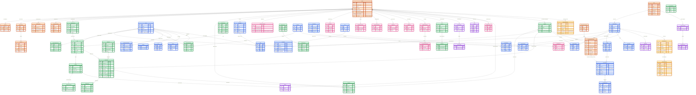

# Modelo de Base de Datos (ERD)

```mermaid
erDiagram
 %% =======================================================
 %% ESTILOS
 %% =======================================================
 classDef publicFill fill:#ffedd5,stroke:#c2410c,stroke-width:2px
 classDef financeFill fill:#dcfce7,stroke:#15803d,stroke-width:2px
 classDef opsFill fill:#dbeafe,stroke:#1d4ed8,stroke-width:2px
 classDef hrFill fill:#f3e8ff,stroke:#7e22ce,stroke-width:2px
 classDef legalFill fill:#fce7f3,stroke:#db2777,stroke-width:2px
 classDef aiFill fill:#fef3c7,stroke:#d97706,stroke-width:2px

 %% =======================================================
 %% GRUPO 1: CORE SAAS (PUBLIC SCHEMA)
 %% =======================================================
 User {
 UUID id PK
 string email
 string password_hash
 string national_id
 datetime last_login
 datetime created_at
 }
 Tenant {
 UUID id PK
 string schema_name
 string name
 boolean is_active
 datetime trial_ends_at
 int purchased_capacity
 decimal credit_balance
 jsonb ai_config "Nuevo: Config IA"
 }
 Domain {
 string domain PK
 boolean is_primary
 UUID tenant_id FK
 }
 PlanCatalog {
 UUID id PK
 string name
 boolean is_active
 }
 PlanTier {
 UUID id PK
 int min_qty
 int max_qty
 decimal unit_price_usd
 UUID plan_id FK
 }
 SaaSPayment {
 UUID id PK
 decimal amount_bs
 string plaza_transaction_id
 datetime created_at
 }
 IntegrationConfig {
 UUID id PK
 enum service
 string api_key
 string webhook_url
 }
 
 class User,Tenant,Domain,PlanCatalog,PlanTier,SaaSPayment,IntegrationConfig publicFill

 %% =======================================================
 %% GRUPO 2: IDENTIDAD & UNIDADES (TENANT SCHEMA)
 %% =======================================================
 TenantProfile {
 UUID id PK
 UUID user_id FK
 enum role
 string phone_number
 }
 
 Unit {
 UUID id PK
 string name "Ej: 1-A"
 decimal aliquot
 string tower_section
 boolean is_common_area
 }

 UnitOwner {
 UUID id PK
 UUID unit_id FK
 UUID profile_id FK
 decimal ownership_percent
 boolean is_responsible "Recibe Cobro"
 }
 
 class TenantProfile,Unit,UnitOwner opsFill

 %% =======================================================
 %% GRUPO 3: FINANZAS COMPLEJAS
 %% =======================================================
 Account {
 UUID id PK
 string name
 decimal current_balance
 enum currency
 }
 BillingPeriod {
 UUID id PK
 string name
 date start_date
 date end_date
 boolean is_closed
 }
 Bill {
 UUID id PK
 string code
 decimal total_amount_usd
 enum status
 date due_date
 UUID unit_id FK
 }
 BillItem {
 UUID id PK
 string description
 decimal amount_usd
 UUID distribution_group_id FK
 }
 DistributionGroup {
 UUID id PK
 string name
 decimal total_relative_aliquot
 }
 Transaction {
 UUID id PK
 decimal amount_bs
 decimal amount_usd
 decimal rate_applied
 string reference
 string proof_image "URL S3"
 enum ocr_status "Nuevo"
 decimal ocr_confidence
 jsonb ocr_raw_data
 }
 Payment {
 UUID id PK
 decimal amount
 string reference_number
 date payment_date
 enum method
 }
 PaymentAgreement {
 UUID id PK
 decimal frozen_debt
 int installments
 decimal interest_rate
 }
 BankRule {
 UUID id PK
 string keyword_pattern
 UUID target_account_id FK
 }
 ExchangeRate {
 datetime timestamp PK
 decimal rate
 string source
 }
 TaxRetention {
 UUID id PK
 string type
 decimal retained_amount
 string proof_doc_url
 }
 AmenityExclusion {
 UUID id PK
 UUID amenity_id FK
 UUID unit_id FK
 string reason
 }
 LeaseContract {
 UUID id PK
 string client_name
 string client_rif
 decimal monthly_fee_usd
 boolean is_active
 }
 Expense {
 UUID id PK
 decimal amount
 string invoice_number
 enum status
 UUID supplier_id FK
 }
 Supplier {
 UUID id PK
 string name
 string rif
 boolean is_special_taxpayer
 }
 BiddingProcess {
 UUID id PK
 string title
 enum status
 }
 BiddingQuote {
 UUID id PK
 decimal amount_usd
 boolean is_winner
 UUID supplier_id FK
 }

 class Account,BillingPeriod,Bill,BillItem,DistributionGroup,Transaction,Payment,PaymentAgreement,BankRule,ExchangeRate,TaxRetention,AmenityExclusion,LeaseContract,Expense,Supplier,BiddingProcess,BiddingQuote financeFill

 %% =======================================================
 %% GRUPO 4: OPERACIONES
 %% =======================================================
 OwnershipTransfer {
 UUID id PK
 UUID old_owner_id FK
 decimal debt_at_transfer
 date transfer_date
 }
 Reservation {
 UUID id PK
 datetime start_time
 datetime end_time
 enum status
 }
 Amenity {
 UUID id PK
 string name
 boolean is_luxury
 }
 Ticket {
 UUID id PK
 enum type
 enum status
 string subject
 }
 SupplierRating {
 UUID id PK
 int stars
 string comment
 }
 AccessLog {
 UUID id PK
 string visitor_name
 string visitor_id_doc
 datetime entry_time
 }
 GuestInvitation {
 UUID id PK
 string qr_token
 datetime expires_at
 }
 PanicAlert {
 UUID id PK
 datetime triggered_at
 string gps_coords
 }
 Assembly {
 UUID id PK
 string topic
 datetime date
 enum status
 decimal quorum_current
 }
 Poll {
 UUID id PK
 string title
 date end_date
 }
 Vote {
 UUID id PK
 enum choice
 decimal weight
 UUID unit_id FK
 }
 Parcel {
 UUID id PK
 string pickup_code
 enum status
 }
 Vehicle {
 UUID id PK
 string plate_number
 }
 Pet {
 UUID id PK
 string name
 string breed
 }

 class OwnershipTransfer,Reservation,Amenity,Ticket,SupplierRating,AccessLog,GuestInvitation,PanicAlert,Assembly,Poll,Vote,Parcel,Vehicle,Pet opsFill

 %% =======================================================
 %% GRUPO 5: LEGAL Y GOBIERNO
 %% =======================================================
 CondoConstitution {
 UUID id PK
 int fiscal_year_start
 decimal reserve_fund_pct
 enum expense_method "Nuevo: ALIQUOT / EQUAL"
 }
 AdministratorBond {
 UUID id PK
 decimal amount
 date expiry_date
 }
 BuildingInsurance {
 UUID id PK
 string policy_number
 date expiry_date
 }
 BoardTerm {
 UUID id PK
 date start_date
 date end_date
 enum status
 }
 BoardPosition {
 UUID id PK
 enum title
 UUID tenant_profile_id FK
 }
 LegalCase {
 UUID id PK
 string case_number
 enum status
 }
 LegalConsultation {
 UUID id PK
 string legal_text
 date deadline_date
 }
 ConsultationResponse {
 UUID id PK
 enum vote_type
 string dissent_reason
 }
 LegalBook {
 UUID id PK
 string name
 int current_folio
 }
 LegalDocument {
 UUID id PK
 enum type
 string url
 }
 
 class CondoConstitution,AdministratorBond,BuildingInsurance,BoardTerm,BoardPosition,LegalCase,LegalConsultation,ConsultationResponse,LegalBook,LegalDocument legalFill

 %% =======================================================
 %% GRUPO 6: RRHH & ACTIVOS
 %% =======================================================
 Asset {
 UUID id PK
 string qr_code
 enum status
 string name
 }
 WorkShift {
 UUID id PK
 datetime check_in
 boolean gps_verified
 }
 EmployeeProfile {
 UUID id PK
 decimal base_salary_bs
 }
 PayrollReceipt {
 UUID id PK
 decimal total_paid
 }
 InventoryItem {
 UUID id PK
 string name
 int current_stock
 }
 InventoryLog {
 UUID id PK
 int quantity_change
 }
 Project {
 UUID id PK
 string name
 decimal goal_amount
 }

 class Asset,WorkShift,EmployeeProfile,PayrollReceipt,InventoryItem,InventoryLog,Project hrFill

 %% =======================================================
 %% GRUPO 7: INTELIGENCIA ARTIFICIAL (TENANT SCHEMA)
 %% =======================================================
 AIKnowledgeBase {
 UUID id PK
 string source_doc
 int chunk_index
 text content
 vector embedding "pgvector(1536)"
 datetime created_at
 }

 AIChatSession {
 UUID id PK
 UUID user_id FK
 enum channel "WA/APP"
 datetime started_at
 datetime last_interaction
 boolean is_active
 }

 AIChatMessage {
 UUID id PK
 UUID session_id FK
 enum role "user/assistant"
 text content
 string intent
 jsonb tool_logs
 int tokens
 }
 
 class AIKnowledgeBase,AIChatSession,AIChatMessage aiFill

 %% =======================================================
 %% RELACIONES (CORREGIDAS)
 %% =======================================================
 
 %% Core & Tenants
 User ||--o{ TenantProfile : "tiene perfil"
 Tenant ||--o{ Domain : "accesible via"
 Tenant ||--o{ PlanCatalog : "plan suscrito"
 PlanCatalog ||--|{ PlanTier : "niveles"
 Tenant ||--o{ SaaSPayment : "facturacion saas"
 Tenant ||--o{ IntegrationConfig : "integraciones"
 
 %% Identidad & Propiedad (CORREGIDO)
 TenantProfile ||--o{ UnitOwner : "posee derechos"
 Unit ||--o{ UnitOwner : "tiene dueños"
 
 %% Finanzas
 Unit ||--o{ Bill : "deuda mensual"
 BillingPeriod ||--o{ Bill : "ciclo"
 Bill ||--o{ BillItem : "items"
 BillItem }o..o| DistributionGroup : "imputacion gastos"
 Bill ||--o{ Transaction : "pago parcial"
 Payment ||--o{ Transaction : "conciliacion"
 Unit ||--o{ PaymentAgreement : "convenio pago"
 Amenity ||--o{ AmenityExclusion : "restriccion"
 Unit ||--o{ AmenityExclusion : "bloqueado en"
 Transaction ||--o{ TaxRetention : "retenciones"
 
 %% Operaciones
 Tenant ||--o{ LeaseContract : "arrienda areas"
 LeaseContract ||--o{ Bill : "genera cobro"
 Tenant ||--o{ Expense : "registra gasto"
 Supplier ||--o{ Expense : "emite factura"
 Transaction ||--o{ Expense : "paga factura"
 
 Supplier ||--o{ BiddingQuote : "cotiza"
 BiddingProcess ||--|{ BiddingQuote : "licitacion"
 Supplier ||--o{ Transaction : "pago a proveedor"
 Supplier ||--o{ SupplierRating : "reputacion"
 TenantProfile ||--o{ SupplierRating : "evalua"

 TenantProfile ||--o{ Reservation : "reserva area"
 Amenity ||--o{ Reservation : "recurso"
 TenantProfile ||--o{ Ticket : "reporta incidente"
 Supplier ||--o{ Ticket : "asignado a"
 TenantProfile ||--o{ GuestInvitation : "crea invitacion"
 AccessLog ||--o{ GuestInvitation : "valida acceso"
 Unit ||--o{ OwnershipTransfer : "historial ventas"
 Unit ||--o{ Vehicle : "estaciona"
 Unit ||--o{ Pet : "dueño"
 Unit ||--o{ Parcel : "paqueteria"
 TenantProfile ||--o{ PanicAlert : "SOS"

 %% Gobernanza
 Tenant ||--o{ Assembly : "convoca"
 Assembly ||--o{ Vote : "votacion en vivo"
 Poll ||--o{ Vote : "urna virtual"
 Unit ||--o{ Vote : "ejerce derecho"

 Tenant ||--|| CondoConstitution : "reglamento"
 Tenant ||--o{ BoardTerm : "periodos junta"
 BoardTerm ||--|{ BoardPosition : "miembros"
 TenantProfile ||--o{ BoardPosition : "ocupa cargo"
 Tenant ||--o{ BuildingInsurance : "polizas"
 Tenant ||--o{ AdministratorBond : "garantia admin"
 Tenant ||--o{ LegalCase : "litigios activos"
 Tenant ||--o{ LegalBook : "libros legales"
 Tenant ||--o{ LegalConsultation : "consultas"
 LegalConsultation ||--o{ ConsultationResponse : "respuestas"
 
 %% RRHH
 TenantProfile ||--o{ WorkShift : "control horario"
 User ||--o{ EmployeeProfile : "datos empleado"
 EmployeeProfile ||--o{ PayrollReceipt : "recibos"
 InventoryItem ||--o{ InventoryLog : "kardex"
 BillItem ||--o{ Project : "financia fondo"
 
 %% Seguridad
 Tenant ||--o{ Account : "cuentas propias"
 Account ||--o{ BankRule : "reglas conciliacion"
 Tenant ||--o{ InventoryItem : "stock almacen"
 Tenant ||--o{ Asset : "activos fijos"
 Tenant ||--o{ LegalDocument : "biblioteca legal"
 Tenant ||--o{ Project : "obras y proyectos"
 Tenant ||--o{ Supplier : "proveedores aprobados"

 %% Modulo de IA (CORREGIDO: RELACION CON TENANT PROFILE)
 TenantProfile ||--o{ AIChatSession : "inicia chat"
 AIChatSession ||--o{ AIChatMessage : "tiene mensajes"
 Tenant ||--o{ AIKnowledgeBase : "memoria vectorial"

%% =======================================================
 %% GRUPO 8: MARKETPLACE (CROSS-SCHEMA)
 %% =======================================================
 MarketplaceCategory {
 UUID id PK
 string name
 string icon_slug
 }
 
 MarketplaceProvider {
 UUID id PK
 string name
 string rif
 enum verification_status
 decimal global_rating
 string whatsapp
 jsonb service_zone
 UUID category_id FK
 }
 
 ServiceOrder {
 UUID id PK
 UUID ticket_id FK
 UUID provider_public_id "REF PUBLIC"
 enum status
 decimal cost_usd
 boolean invoiced
 }
 
 ProviderReview {
 UUID id PK
 UUID service_order_id FK
 int rating
 text comment
 boolean is_public
 }
 
 class MarketplaceCategory,MarketplaceProvider publicFill
 class ServiceOrder,ProviderReview opsFill

 %% Relaciones Marketplace
 MarketplaceCategory ||--|{ MarketplaceProvider : "agrupa"
 Ticket ||--o{ ServiceOrder : "genera orden"
 ServiceOrder ||--o{ ProviderReview : "calificacion"
 
 %% RELACION LOGICA ENTRE ESQUEMAS (Línea Punteada)
 MarketplaceProvider |o..o{ ServiceOrder : "contratado en (Cross-Schema)"
```
