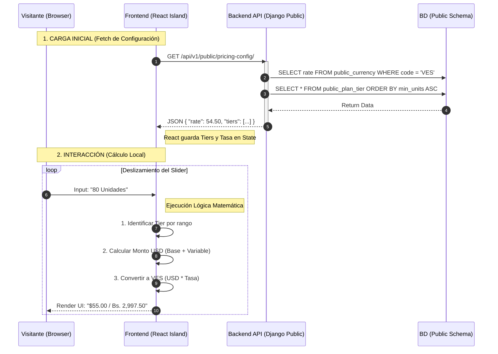
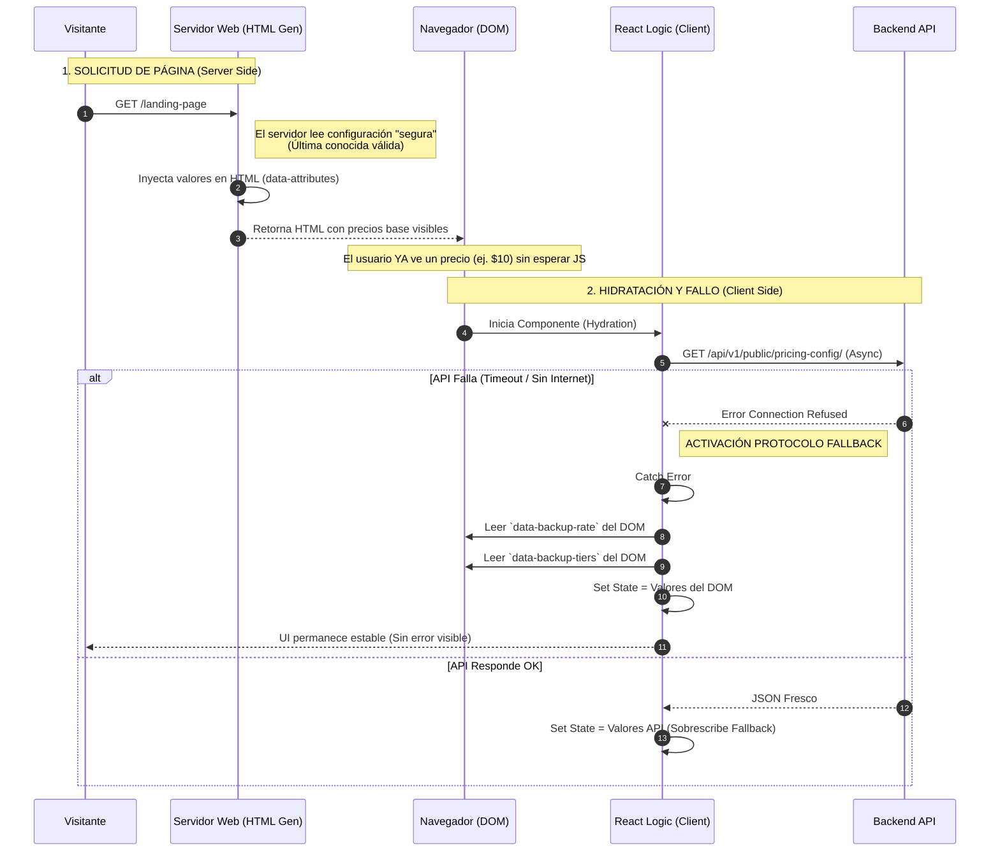
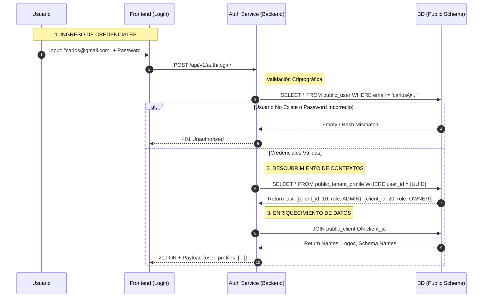
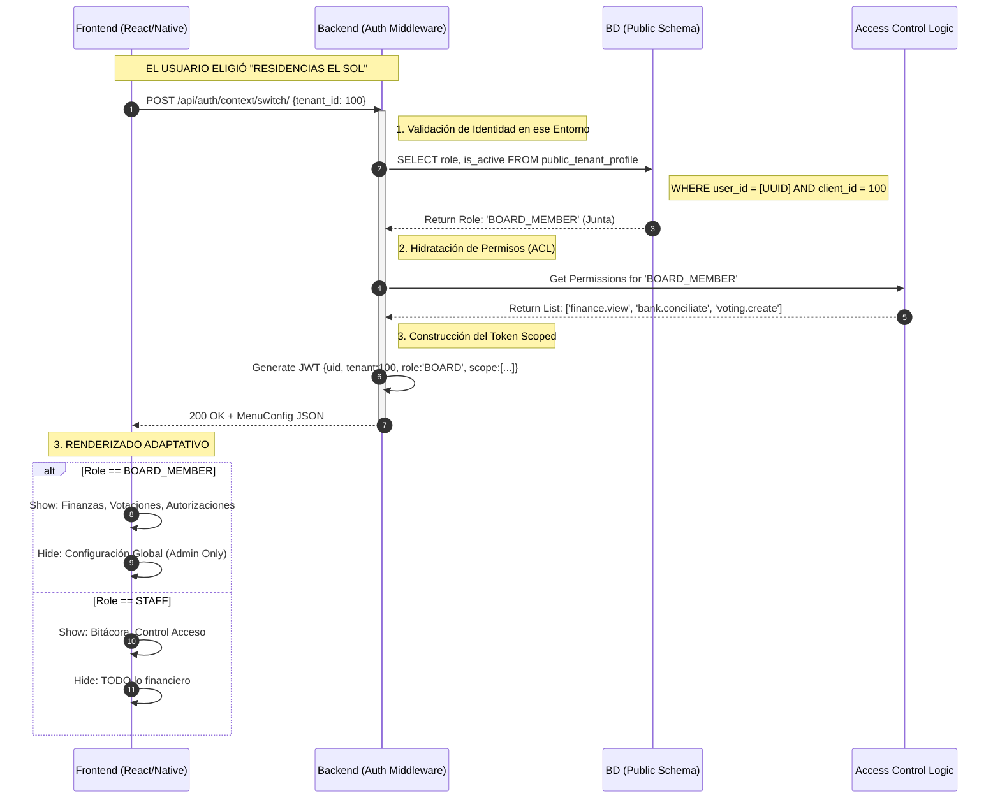
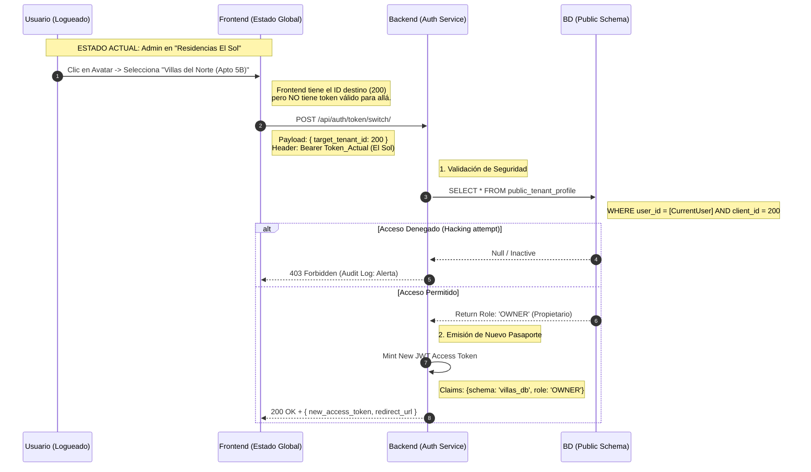
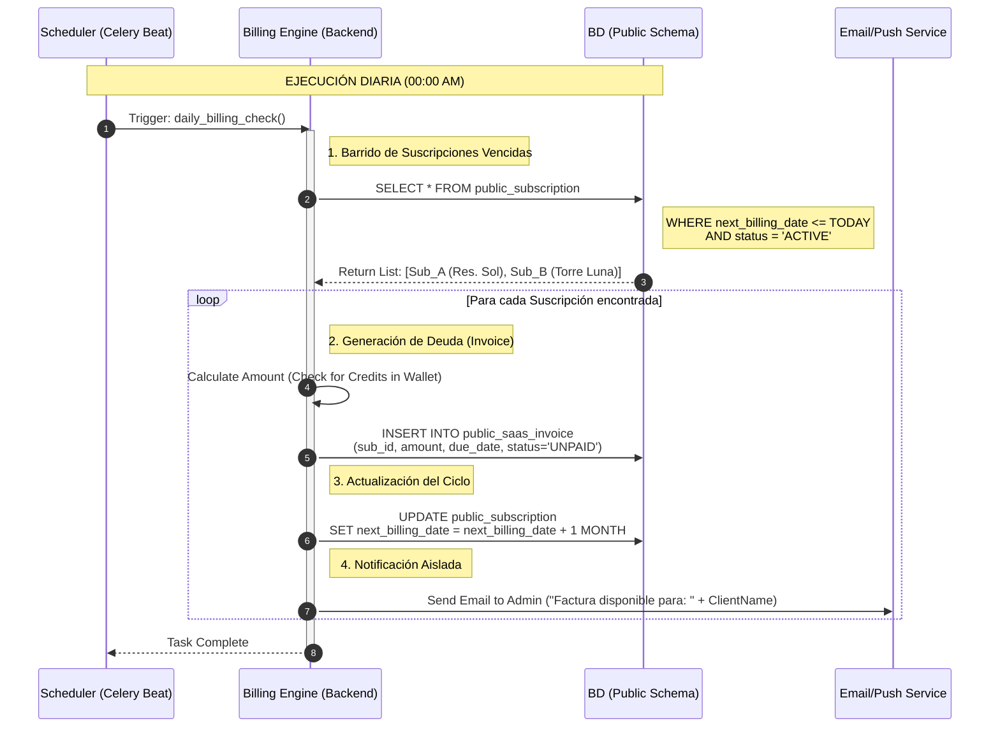
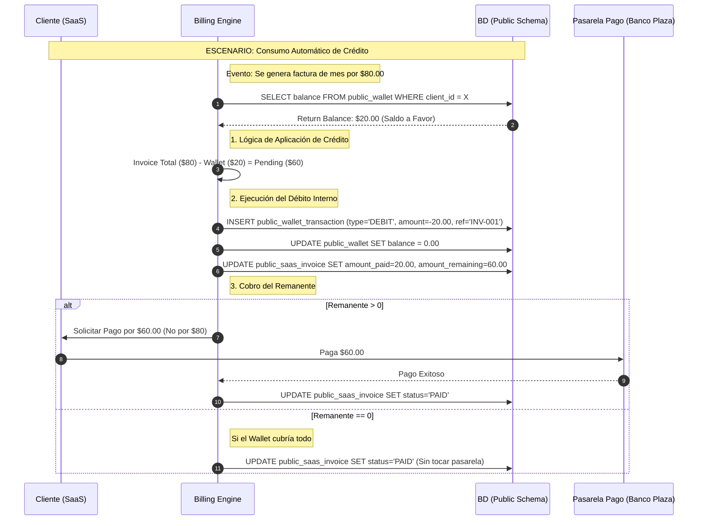
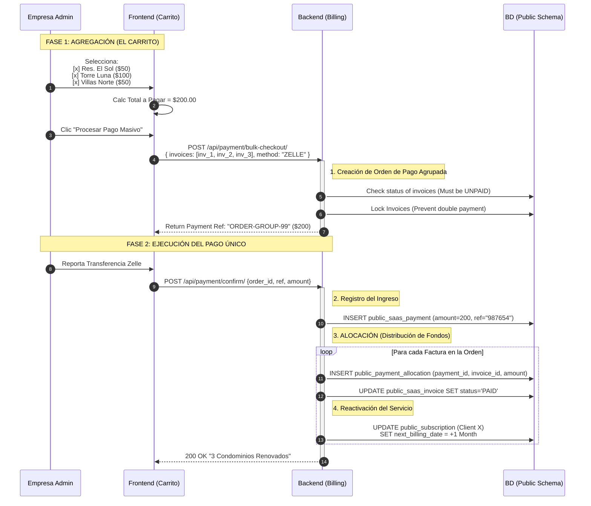
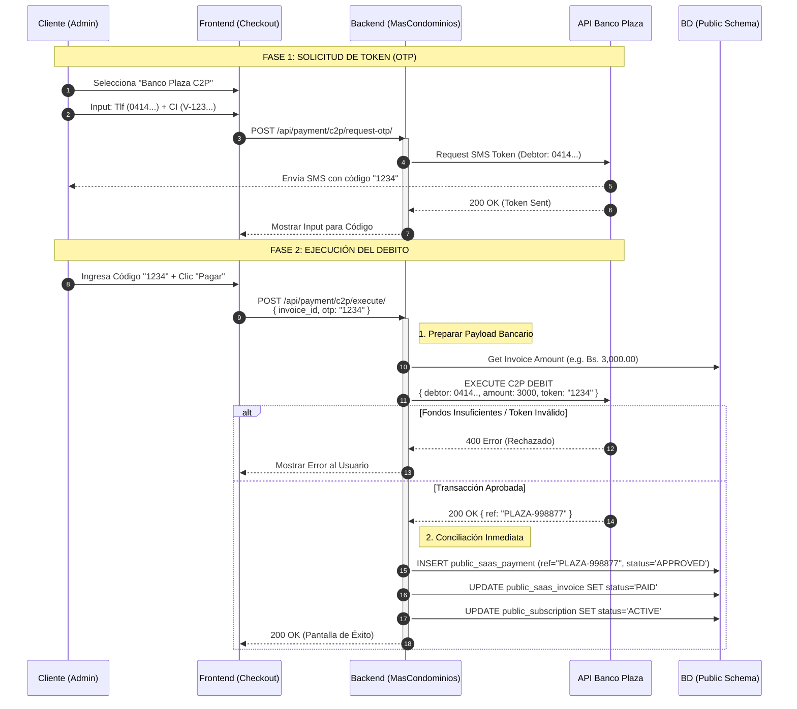

**Función 1: Calculadora de Precios Interactiva (Isla de React)**

Ficha Técnica
Contexto: Landing Page (Pública) / Sitio Web de Marketing.
Tecnología: React Island (Frontend) + Django REST Framework (Backend).
Ubicación en BD: Public Schema (Datos globales, no de inquilinos).
Tablas Involucradas (Lectura):
public.Currency (Columna: rate para 'VES').
public.PlanTier (Columnas: min_units, max_units, base_fee, unit_price).
Disparador: Carga de página (componentDidMount / useEffect) y evento onChange del Slider.
Objetivo: Proporcionar cotización instantánea en USD y Bolívares sin latencia de red durante el deslizamiento.

**Diagrama de Secuencia Lógico**



**Refuerzo Lógico:** Trace de Datos
A. Datos Maestros (Backend - Public Schema):
Tasa de Cambio (public.Currency): code: 'VES', rate: 54.50
Reglas de Precio (public.PlanTier):

**Función 2: Fallback Estático (Precio "quemado" en HTML)**

Ficha Técnica
Contexto: Landing Page (Pública) - Carga Inicial.
Tecnología: Server-Side Rendering (SSR) o Static Site Generation (SSG) inyectando datos al DOM.
Origen de Datos (Snapshot): public.Currency y public.PlanTier (Valores obtenidos al momento del despliegue o renderizado del servidor, no del cliente).
Mecanismo de Persistencia: Atributos HTML data-* en el contenedor del widget.
Disparador: Excepción NetworkError, Timeout o 500 Internal Server Error en la petición AJAX del cliente.
Objetivo: Evitar la "Pantalla Blanca de la Muerte" o precios en $0.00/NaN cuando falla la conectividad.

**Diagrama de Secuencia Lógico**



**Refuerzo Lógico:** Trace de Datos (Ejemplo)
Para el agente de programación, este ejemplo define exactamente qué datos inyectar en el HTML y cómo usarlos en caso de emergencia.
A. Datos "Quemados" en HTML (Server-Side Snapshot):
El código fuente entregado al navegador incluye un contenedor con la configuración de respaldo (basada en el último despliegue exitoso):
code
Html
<div id="pricing-widget-root"
     data-backup-rate="50.00"
     data-backup-base-fee="15.00"
     data-backup-unit-fee="0.50">
     $15.00 / Bs. 750.00
</div>
B. Escenario de Error:
Situación: El usuario entra desde un ascensor (señal intermitente).
Petición React: fetch('/api/...') falla después de 3 segundos.
C. Ejecución Lógica (Recovery):
React captura la excepción.
Lectura:
rate = parseFloat(element.dataset.backupRate) -> 50.00
fee = parseFloat(element.dataset.backupUnitFee) -> 0.50
Acción: El estado de la aplicación se inicializa con estos valores.
Cálculo (Si el usuario mueve el slider a 100):
USD: 
15.00
+
(
100
∗
0.50
)
=
∗
∗
15.00+(100∗0.50)=∗∗
65.00**
Bs: $65.00 * 50.00 = Bs. 3,250.00
Gestión de Identidad (Auth)


**Función 3: Login Global (Un solo usuario para múltiples condominios)**

Ficha Técnica
Contexto: Pantalla de Inicio de Sesión (App Móvil o Web).
Tecnología: JWT (JSON Web Tokens) + Django Auth (Custom Model).
Ubicación en BD: Public Schema (Nivel infraestructura).
Tablas Involucradas:
public.User: Almacena credenciales únicas (Email, Password Hash, UUID Global).
public.TenantProfile: Tabla pivote crítica (User_ID + Client_ID + Role + Status).
public.Client: Metadatos del condominio (Nombre, Schema Name, Dominio, Logo).
Disparador: Formulario onSubmit (Email + Password).
Objetivo: Autenticar las credenciales una sola vez y retornar el "Llavero de Accesos" (lista de todos los condominios donde el usuario tiene permiso).

**Diagrama de Secuencia Lógico**


    deactivate Auth
    
    Note over FE: El Frontend decide:
    Note over FE: A) Si tiene 1 perfil -> Auto-Login
    Note over FE: B) Si tiene N perfiles -> Muestra selector

**Refuerzo Lógico:** Trace de Datos (Ejemplo Multi-Rol)
Este trace demuestra cómo el sistema maneja la dualidad de roles (Admin en un sitio, Vecino en otro) con la misma cuenta.
A. Datos Maestros (Public Schema):
Tabla public.User:
id: UUID-CARLOS-001
email: carlos@gmail.com
password: hash_argon2...
Tabla public.Client (Edificios):
id: 10 | name: "Residencias Doral" | schema: doral_db
id: 20 | name: "Torre Ejecutiva" | schema: torre_db
Tabla public.TenantProfile (El Llavero):
Registro 1: {user_id: UUID-CARLOS-001, client_id: 10, role: 'ADMIN_MASTER'}
Registro 2: {user_id: UUID-CARLOS-001, client_id: 20, role: 'RESIDENT_OWNER'}
B. Ejecución del Login:
Input: Carlos ingresa sus credenciales.
Validación: Password correcto.
Query de Perfiles: El sistema busca en TenantProfile donde user_id = UUID-CARLOS-001.
C. Respuesta JSON (Output):
El Backend devuelve esto al Frontend para que dibuje la interfaz:
code
JSON
{
  "user_global_id": "UUID-CARLOS-001",
  "email": "carlos@gmail.com",
  "available_contexts": [
    {
      "tenant_id": 10,
      "tenant_name": "Residencias Doral",
      "schema_name": "doral_db",
      "role": "ADMIN_MASTER",
      "action": "DASHBOARD_FULL"
    },
    {
      "tenant_id": 20,
      "tenant_name": "Torre Ejecutiva",
      "schema_name": "torre_db",
      "role": "RESIDENT_OWNER",
      "action": "APP_RESIDENTE"
    }
  ]
}
D. Comportamiento UI: Al recibir este JSON, la aplicación NO entra directo. Muestra la pantalla "Selecciona tu Perfil" (Vista en las imágenes de Visily), permitiendo a Carlos decidir si va a trabajar como Administrador o a pagar su condominio personal.

**Función 4: Perfilamiento de Usuario (Roles y Permisos)**

Ficha Técnica
**Contexto:** Carga del Dashboard o App (Post-Login / Post-Selección de Contexto).
Tecnología: Middleware de Django + React Context API (Frontend).
Ubicación en BD: Public Schema (Definición del Rol) y Tenant Schema (Permisos granulares).
Tablas Involucradas:
public.TenantProfile: Contiene el campo role (Enum: ADMIN, BOARD_MEMBER, OWNER, STAFF, COMPANY).
tenant.RolePermission (Opcional/Implícito): Mapeo de qué botones puede tocar cada rol dentro de ese esquema.
Disparador: Generación del Token de Acceso (JWT) para un Tenant específico.
Objetivo: Entregar al Frontend la lista de capacidades (capabilities) para que pinte o esconda menús (ej. El conserje no ve Finanzas, el Tesorero sí ve Conciliación).

**Diagrama de Secuencia Lógico**



**Refuerzo Lógico:** Trace de Datos (La Matriz de Roles)
Este trace es vital para que el agente de programación entienda cómo un mismo sistema se comporta de 5 formas distintas según el dato en TenantProfile.
A. Datos Maestros (public.TenantProfile):
Supongamos 3 usuarios distintos entrando al mismo edificio (Tenant ID 100):
Usuario A (La Administradora):
user_id: UUID-ADMIN
role: ADMIN_COMPANY
Lógica: Acceso Total (God Mode del Tenant). Puede configurar tasas, crear usuarios y ver contabilidad.
Usuario B (El Tesorero - Junta):
user_id: UUID-TESORERO
role: BOARD_MEMBER (Sub-tipo: Treasurer)
Lógica: Acceso Financiero + Operativo. NO puede borrar el Tenant ni cambiar la configuración del SaaS, pero SÍ puede aprobar pagos y ver bancos.
Usuario C (El Vigilante - Staff):
user_id: UUID-VIGILANTE
role: STAFF_SECURITY
Lógica: Acceso Restringido (UI Simplificada). Solo ve pantallas de QR, Bitácora y Botón de Pánico. El backend rechaza cualquier petición a /api/finance/.
B. JSON de Configuración de Menú (Output al Frontend):
Cuando entra el Usuario B (Tesorero), la API responde:
code
JSON
{
  "role": "BOARD_MEMBER",
  "permissions": ["view_finance", "approve_payments", "create_ticket"],
  "ui_layout": "standard_dashboard",
  "menu": {
    "dashboard": true,
    "finanzas": true,
    "seguridad": true,
    "configuracion": false // <--- Bloqueado por Rol
  }
}
Cuando entra el Usuario C (Vigilante):
code
JSON
{
  "role": "STAFF_SECURITY",
  "permissions": ["scan_qr", "log_entry", "panic_button"],
  "ui_layout": "security_mode_dark", // <--- Activa UI Oscura específica (Ver Visily)
  "menu": {
    "dashboard": false,
    "finanzas": false, // <--- Bloqueado
    "seguridad": true, // <--- Único acceso
    "configuracion": false
  }
}

**Función 5: Switch de Contexto (Cambio rápido de rol Admin/Propietario sin salir)**

Ficha Técnica
**Contexto:** Menú de Usuario (Avatar en esquina superior derecha) o Sidebar.
Tecnología: Intercambio de JWT (Token Exchange).
Ubicación en BD: Public Schema (Validación de derecho de acceso).
Tablas Involucradas:
public.TenantProfile: Verifica que el usuario realmente pertenezca al "destino" solicitado.
Disparador: Selección de un ítem en el dropdown "Mis Cuentas".
Objetivo: Obtener un nuevo Access Token firmado con el schema_name del destino, forzando al Frontend a recargar la UI con los nuevos permisos y colores.
Diagrama de Secuencia Lógico


    deactivate Auth
    
    Note over FE: TRANSICIÓN DE UI
    FE->>FE: Reemplazar Token en LocalStorage
    FE->>FE: Flush Data Cache (Borrar datos de "El Sol")
    FE->>FE: Redirect / Refresh -> Dashboard Residente
    
    Note over User: UI cambia: De Gráficas Admin a Botón "Pagar"

**Refuerzo Lógico:** Trace de Datos (La Metamorfosis)
Este ejemplo muestra al agente de programación cómo el objeto User cambia radicalmente de forma ante los ojos del Frontend.
A. Estado Inicial (Origen):
Contexto: Tenant ID 100 (Residencias El Sol).
Token Decodificado:
schema: sol_db
role: ADMIN
permissions: [all]
UI Visible: Panel de Control, Balance General, Gestión de Morosos.
B. Acción del Usuario:
Solicita cambio a Tenant ID 200 (Villas del Norte).
C. Lógica Backend (Validación Cross-Tenant):
El Backend recibe la petición con la identidad de "Carlos".
Verifica en public.TenantProfile: ¿Carlos está en el Tenant 200? -> SÍ.
Verifica estado: ¿Está activo? -> SÍ.
Genera Token Nuevo.
D. Estado Final (Destino):
Contexto: Tenant ID 200 (Villas del Norte).
Nuevo Token Decodificado:
schema: villas_db
role: OWNER
unit_id: UUID-APTO-5B (Dato extra inyectado para propietarios)
permissions: [pay_bill, view_visits, panic_sos]
UI Visible: El Frontend detecta el cambio de rol y renderiza:
Se oculta el Sidebar de Administración.
Aparece la tarjeta "Mi Deuda Actual".
Aparece el botón rojo "SOS".

**Función 6: Gestión de Núcleo Familiar (Invitaciones)**

Ficha Técnica
**Contexto:** App Móvil del Propietario -> Sección "Mi Unidad" -> "Residentes".
Tecnología: Deep Linking (para abrir la App) + Token de Invitación Firmado.
Ubicación en BD: Interacción cruzada Tenant Schema (Unidad/Residente) y Public Schema (Permisos globales).
Tablas Involucradas:
tenant.Unit: El apartamento origen (ej. Apto 5-B).
tenant.Resident: Tabla de enlace local (Unidad + Usuario + Rol Familiar).
public.TenantProfile: El permiso de entrada al edificio.
Disparador: Botón "Agregar Familiar" o "Invitar Inquilino".
Objetivo: Crear un vínculo validado entre un Usuario externo y una Unidad existente sin intervención del Administrador.

**Diagrama de Secuencia Lógico**

```mermaid
sequenceDiagram
    autonumber
    participant Owner as Propietario (Apto 5-B)
    participant FE as App Móvil
    participant BE as Backend (Tenant Context)
    participant DB_T as DB (Tenant Schema)
    participant DB_P as DB (Public Schema)
    participant Notify as Email/WhatsApp

    Note over Owner, BE: FASE 1: GENERACIÓN DE INVITACIÓN

    Owner->>FE: Input: "Maria Pérez" + "maria@gmail.com" + Rol: "Esposa"
    FE->>BE: POST /api/unit/residents/invite/
    
    activate BE
    Note right of BE: 1. Validación de Propiedad
    BE->>DB_T: Verify Requestor is OWNER of Unit 5-B
    
    Note right of BE: 2. Registro Pendiente
    BE->>DB_T: INSERT INTO resident (unit_id, email, role, status='PENDING')
    
    Note right of BE: 3. Envío
    BE->>BE: Generate Signed Token (Payload: email + unit_id)
    BE->>Notify: Send Link ("Únete a Residencias El Sol")
    BE-->>FE: 200 OK (Invitación Enviada)
    deactivate BE
    
    Note over Owner, Notify: FASE 2: ACEPTACIÓN (El Familiar)
    
    Note right of Notify: Maria recibe el link
    Notify->>FE: Clic en Link -> Abre App/Web
    FE->>BE: POST /api/invitation/accept/ {token}
    
    activate BE
    BE->>BE: Validate Token Signature
    
    Note right of BE: 4. Resolución de Identidad
    BE->>DB_P: Check if 'maria@gmail.com' exists in Public User
    
    alt Usuario Nuevo
        BE-->>FE: Redirect -> Sign Up Flow (Crear Password)
        FE->>BE: Register Success
    end
    ```
    Note right of BE: 5. Vinculación Final (Commit)
    BE->>DB_P: INSERT public_tenant_profile (User=Maria, Client=Sol, Role=RESIDENT)
    BE->>DB_T: UPDATE resident SET user_id=MariaUUID, status='ACTIVE' WHERE email='maria...'
    
    BE-->>FE: 200 OK "Bienvenida a Casa"
    deactivate BE

**Refuerzo Lógico:** Trace de Datos (El Árbol Genealógico)
Este ejemplo muestra cómo se estructura la jerarquía dentro de un apartamento.
A. Estado Inicial (La Unidad):
Tabla tenant.Unit:
id: Unit-5B
number: "5-B"
floor: "5"
Tabla tenant.Resident (Ocupantes actuales):
Registro 1: {user: Juan (Propietario), role: 'OWNER_TITULAR', is_voting_right: True}
B. Input (La Invitación):
Juan invita a Maria.
Datos: email: maria@gmail.com, role_label: 'FAMILY', voting_right: False.
C. Lógica de Base de Datos (Transición):
Insert Preliminar (tenant.Resident):
unit_id: Unit-5B
email: maria@gmail.com
user_id: NULL (Aún no ha aceptado/llegado)
status: PENDING
Al Aceptar (Backend):
El sistema busca el UUID de Maria en public.User (UUID-MARIA).
Crea el Pasaporte en public.TenantProfile:
client: El Sol, user: UUID-MARIA, role: RESIDENT.
Actualiza el Vínculo en tenant.Resident:
user_id: UUID-MARIA
status: ACTIVE
D. Resultado Operativo:
Juan (Dueño): Ve en su App: "Maria Pérez - Activo". Puede revocarle el acceso si se divorcian (Kill-switch familiar).
Maria (Co-Residente):
Al entrar a la App, ve "Residencias El Sol".
Puede: Generar QR de visita, ver recibos, reservar piscina.
NO Puede: Votar en asambleas (si voting_right=False), ver deuda de otros vecinos.

**Función 7: Gestión de Staff Operativo (Invitación WhatsApp, Login Móvil, Kill-Switch)**

Ficha Técnica
**Contexto:**
Admin: Panel Web -> Módulo "Equipo y Staff".
Staff: App Móvil (Login simplificado con Celular + PIN).
Tecnología: WhatsApp Business API (o Gateway local), Auth Custom Backend (PhoneAuth).
Ubicación en BD: Public Schema (Identidad) y Tenant Schema (Roles locales).
Tablas Involucradas:
public.User: Manejo de identidad sin email real. Campo username = Número de teléfono.
public.TenantProfile: Define el rol (SECURITY, JANITOR) y estado (is_active). Campo property_id debe ser NULL.
Disparador: Botón "Contratar/Agregar Personal".
Objetivo: Permitir el acceso digital a trabajadores no tecnológicos y retirarlo instantáneamente en caso de despido.
Diagrama de Secuencia Lógico

```mermaid
sequenceDiagram
    autonumber
    participant Admin as Administrador
    participant BE as Backend API
    participant DB as BD (Public/Tenant)
    participant WA as WhatsApp Gateway
    participant Staff as Vigilante (App)

    Note over Admin, WA: FASE 1: INVITACIÓN (SIN EMAIL)

    Admin->>BE: POST /api/staff/invite/
    Note right of Admin: Payload: { Name: "José", Phone: "+58412...", Role: "SECURITY" }
    
    activate BE
    BE->>DB: Check if Phone exists in public.User
    
    alt Usuario Nuevo
        BE->>DB: INSERT public.User (username="+58412...", email="dummy_uuid@staff.local")
    end
    ```

    BE->>DB: INSERT public.TenantProfile (user=José, client=Current, role=SECURITY, status=PENDING)
    
    BE->>BE: Generate One-Time-Link (Token corto)
    BE->>WA: Send Template Message ("Hola José, activa tu cuenta aquí: bit.ly/xyz")
    WA-->>Staff: Recibe WhatsApp
    deactivate BE
    
    Note over Staff, BE: FASE 2: ONBOARDING Y PIN
    
    Staff->>WA: Clic en Link
    WA->>Staff: Deep Link abre App MasCondominios
    Staff->>BE: POST /api/auth/setup-pin/ {token, new_pin: "1984"}
    
    activate BE
    BE->>DB: UPDATE public.User SET password=Hash("1984")
    BE->>DB: UPDATE public.TenantProfile SET status='ACTIVE'
    BE-->>Staff: 200 OK + JWT Token (Scope: Security)
    deactivate BE
    
    Note over Admin, Staff: FASE 3: KILL-SWITCH (DESPIDO)
    
    Admin->>BE: POST /api/staff/terminate/ {staff_id: "UUID-JOSE"}
    activate BE
    Note right of BE: Acción Atómica Inmediata
    BE->>DB: UPDATE public.TenantProfile SET is_active=FALSE WHERE user_id="UUID-JOSE"
    BE->>BE: Invalidate/Blacklist Active Refresh Tokens
    
    BE-->>Admin: "Acceso Revocado Exitosamente"
    deactivate BE
    
    Note right of Staff: José intenta abrir la puerta (QR)
    Staff->>BE: POST /api/access/validate-qr/
    BE-->>Staff: 403 Forbidden ("Cuenta Inactiva")
    Staff->>Staff: Logout Forzoso

**Refuerzo Lógico:** Trace de Datos (El Ciclo de Vida del Staff)
Este trace asegura que el agente entienda cómo crear usuarios "invitados" que no usan correo electrónico y cómo bloquearlos efectivamente.
A. Input Admin (Alta):
Nombre: José Gregorio
Teléfono: +58 412 5550000
Rol: Vigilante
B. Estructura en BD (public.User - Identidad Sombra):
id: UUID-JOSE
username: +584125550000 (Clave de unicidad)
email: +584125550000@no-email.mascondominios.com (Generado automáticamente para cumplir constraints de Django).
password: pbkdf2_sha256$... (Hash del PIN creado por José).
C. Estructura en BD (public.TenantProfile - El Permiso):
user_id: UUID-JOSE
client_id: 100 (El Edificio)
role: SECURITY
property_id: NULL (Importante: No vincular a un apartamento).
is_active: True
D. Ejecución Kill-Switch (Baja):
Admin presiona "Eliminar Acceso".
Backend actualiza public.TenantProfile:
is_active = False.
termination_date = NOW().
Resultado en App de José:
Su JWT Token tiene firma válida, PERO el middleware de seguridad verifica TenantProfile.is_active en cada petición crítica.
Al recibir False, el Backend devuelve 403 y una señal para borrar el token del almacenamiento local del teléfono.
Motor de Suscripción (Billing)

**Función 8: Precios Dinámicos por Volumen (Motor de Validación y Contratación)**
Ficha Técnica
**Contexto:** Proceso de Checkout / Finalización del Wizard de Onboarding.
Tecnología: Python (Django) Business Logic.
Ubicación en BD: Public Schema (Datos de facturación del SaaS).
Tablas Involucradas:
public.PlanTier: Reglas de negocio (Rangos y Tarifas).
public.Client: Se actualiza con el unit_count (cantidad de inmuebles).
public.Subscription: Se crea el contrato con el amount (USD) calculado y congelado.
Disparador: API POST /api/v1/subscription/create/ (Cuando el cliente dice "Contratar").
Objetivo: Recalcular en el servidor el precio final (Server-Side Validation) para asegurar la integridad financiera antes de generar la orden de pago.
Diagrama de Secuencia Lógico

```mermaid
sequenceDiagram
    autonumber
    participant Admin as Cliente (Frontend)
    participant API as Backend (Billing Engine)
    participant DB as BD (Public Schema)

    Note over Admin, API: INPUT: El usuario seleccionó 120 Unidades en el Slider

    Admin->>API: POST /api/subscription/create/<br>{ "units": 120, "tier_id": "tier_b" }
    
    activate API
    Note right of API: 1. VALIDACIÓN DE INTEGRIDAD (Anti-Tampering)
    API->>DB: SELECT * FROM public_plan_tier WHERE id = "tier_b"
    DB-->>API: Return {min: 51, max: 200, base: 15.00, unit: 0.50}
    
    API->>API: Verify: 120 is between 51 and 200?
    alt Rango Inválido (Hack Attempt)
        API-->>Admin: 400 Bad Request ("Volumen no coincide con Tier")
    else Rango Válido
    
        Note right of API: 2. CÁLCULO AUTORITATIVO (Server Side)
        API->>API: Price = Base(15) + (120 * 0.50)
        API->>API: Total MRR = $75.00
        
        Note right of API: 3. PERSISTENCIA DEL CONTRATO
        API->>DB: UPDATE public_client SET unit_count = 120
        API->>DB: INSERT INTO public_subscription<br/>(client_id, amount=75.00, currency='USD', status='PENDING_PAYMENT')
        
        API-->>Admin: 200 OK<br/>{ "contract_id": "SUB-999", "final_amount": 75.00 }
    end
    deactivate API
```

**Refuerzo Lógico:** Trace de Datos (El Algoritmo de Cobro)
Este trace es fundamental para el agente de programación: define la fórmula exacta que debe codificarse en Python para que coincida con lo que el usuario vio en React.
A. Datos Maestros (public.PlanTier):
ID: tier_standard
Rango: 51 - 200 unidades.
Tarifas:
base_fee: $15.00 (Costo fijo por uso de plataforma).
unit_price: $0.50 (Costo variable por apartamento).
B. Input del Cliente (Payload POST):
code
JSON
{
  "client_id": "UUID-SOL",
  "units_declared": 120
}
C. Ejecución Lógica (Python/Django View):
Lookup: El sistema busca qué Tier corresponde a 120 unidades. -> Encuentra tier_standard.
Cálculo:
Variable: 120 * 0.50 = $60.00
Fijo: 15.00
Total Mensual (MRR): $75.00
Comparación de Seguridad (Sanity Check): Si el Frontend envió { "units": 120, "expected_price": 20.00 }, el Backend rechaza la operación porque el cálculo da $75.00.
D. Persistencia (public.Subscription):
id: SUB-2024-888
amount: 75.00 (Se guarda el valor calculado, NO la referencia a la fórmula. Esto es vital para respetar el precio si suben las tarifas en el futuro - "Grandfathering").
currency: USD
next_billing_date: 2024-02-01
Función 9: Suscripción por Entidad (Motor de Ciclos Independientes)
Ficha Técnica
Contexto: Proceso en Segundo Plano (Background Task / Cronjob) que corre diariamente.
Tecnología: Celery Beat (Scheduler) + Django ORM.
Ubicación en BD: Public Schema.
Tablas Involucradas:
public.Subscription: Contiene next_billing_date, status y amount.
public.SaaSInvoice: (Nueva tabla lógica/física) El recibo de cobro generado mes a mes.
public.Client: El edificio deudor.
Disparador: Tarea programada 00:00 AM todos los días.
Objetivo: Identificar qué edificios cumplen mes hoy, generar su factura individual y cambiar su estado a "Pendiente de Pago" sin afectar a los otros edificios del mismo administrador.
Diagrama de Secuencia Lógico



**Refuerzo Lógico:** Trace de Datos (El Caso del Administrador Multi-Edificio)
Este trace muestra cómo el sistema discrimina entre edificios manejados por la misma persona.
A. Estado Inicial (Base de Datos):
El usuario "Pedro Admin" gestiona dos edificios:
Residencias El Sol (Client ID 100):
Subscription: {id: S1, amount: $80, next_billing_date: 2024-02-15}
Nota: Su corte es los 15 de cada mes.
Torre Ejecutiva (Client ID 200):
Subscription: {id: S2, amount: $120, next_billing_date: 2024-02-28}
Nota: Su corte es a fin de mes.
B. Evento del Sistema (El Cronjob corre el 15 de Febrero):
Query: SELECT * FROM Subscription WHERE next_billing_date = '2024-02-15'.
Resultado:
Encuentra S1 (Residencias El Sol).
Ignora S2 (Torre Ejecutiva) (Aún no le toca).
C. Ejecución de Lógica:
Generar Factura S1: Crea Invoice #INV-2024-001 por $80.00 vinculada a Residencias El Sol.
Avanzar Fecha S1: Actualiza next_billing_date al 2024-03-15.
Notificar: Pedro recibe un correo: "Tu factura de Residencias El Sol está lista".
D. Resultado Operativo:
Pedro entra al Dashboard.
Si filtra por "El Sol" -> Ve alerta de pago pendiente.
Si filtra por "Torre Ejecutiva" -> Ve estatus "Al día".
No hay bloqueo cruzado: Si Pedro no paga "El Sol", el sistema suspende solo "El Sol". "Torre Ejecutiva" sigue operando normalmente porque es una entidad financiera aislada.

**Función 10: Billetera Virtual SaaS (Wallet Logic)**
Ficha Técnica
**Contexto:**
Origen: Al hacer Downgrade (bajar unidades).
Destino: Al generarse la siguiente Factura de Renovación.
Tecnología: Lógica Transaccional ACID (Base de Datos).
Ubicación en BD: Public Schema.
Tablas Involucradas:
public.Wallet: Almacena el saldo actual (balance) por Cliente.
public.WalletTransaction: Historial inmutable de movimientos (Créditos/Débitos).
public.SaaSInvoice: La factura que intenta cobrarse.
Disparador: Generación automática de factura (Cronjob) o Ajuste Manual.
Objetivo: Priorizar el consumo del saldo en Billetera antes de pedir dinero a la tarjeta de crédito/banco del cliente.
Diagrama de Secuencia Lógico


**Refuerzo Lógico:** Trace de Datos (Auditoría Financiera)
Este trace es crucial para que el agente de programación entienda que el Wallet no es solo una variable, sino un libro mayor contable.
A. Estado Inicial (Antes de la Facturación):
Cliente: Residencias El Sol
Wallet Balance: $20.00 (Proveniente de un Downgrade anterior).
Historial (public.WalletTransaction):
#1: 2024-01-15 | CREDIT | +$20.00 | Ref: Ajuste Downgrade Plan
B. Evento:
Llega el 1 de Febrero. Se genera la Factura #INV-Feb por $80.00.
C. Ejecución Lógica (El Cruce):
Detección: El sistema ve que hay $20.00 disponibles.
Operación Matemática: $80.00 (Deuda) - $20.00 (Wallet) = $60.00 (A pagar).
Transacción de Base de Datos (Atomicidad):
Inserta en WalletTransaction:
type: DEBIT
amount: -20.00
related_invoice: #INV-Feb
Actualiza Wallet:
balance: $0.00
D. Resultado Operativo:
La factura #INV-Feb muestra:
Subtotal: $80.00
Créditos Aplicados: -$20.00
Total a Pagar: $60.00
El sistema solo pide $60.00 a la tarjeta o Pago Móvil del cliente.

**Función 11: Renovación Masiva (Carrito de Compras Multi-Tenant)**
Ficha Técnica
Contexto: Dashboard del "Super Administrador" (Vista de Cartera de Clientes).
Tecnología: Procesamiento por Lotes (Batch Processing) / Transacciones Atómicas.
Ubicación en BD: Public Schema.
Tablas Involucradas:
public.SaaSInvoice: Las facturas pendientes de cada edificio.
public.SaaSPayment: El ingreso de dinero real (La transferencia global).
public.PaymentAllocation: (Tabla Crucial) Tabla intermedia que desglosa cómo un solo pago cubre múltiples facturas (payment_id + invoice_id + amount_allocated).
Disparador: Selección de múltiples checkboxes -> Botón "Pagar Seleccionados".
Objetivo: Recibir un monto único (ej. $500) y distribuir matemáticamente el saldo para saldar N facturas de distintos clientes, actualizando sus fechas de vencimiento simultáneamente.
Diagrama de Secuencia Lógico



**Refuerzo Lógico:** Trace de Datos (La Distribución Contable)
Este trace muestra cómo el sistema evita mezclar las deudas. Aunque el dinero entra junto, contablemente se separa para cada edificio.
A. Deuda Pendiente (Input):
Factura #A (Residencias El Sol): $50.00 | Estado: UNPAID
Factura #B (Torre Luna): $100.00 | Estado: UNPAID
Factura #C (Villas Norte): $50.00 | Estado: UNPAID
B. Acción de Pago:
La Administradora hace UN (1) Zelle por $200.00.
Referencia: Z-99999.
C. Lógica de Persistencia (Backend):
Registro Maestro (public.SaaSPayment):
id: PAY-001
total_amount: $200.00
reference: Z-
Tier 1: Rango 1-50 | Base $10.00 | C/U $0.80
Tier 2: Rango 51-200 | Base $15.00 | C/U $0.50
B. Input Usuario: Slider en posición: 80.
C. Lógica de Cálculo (Frontend):
Selección: 80 es mayor que 51 y menor que 200 -> Aplica Tier 2.
Fórmula USD: Base($15.00) + (80 unids * $0.50) = $55.00
Fórmula VES: $55.00 * 54.50 = Bs. 2,997.50
D. Salida Visual: price_usd: 55.00, price_ves: 2997.50.

**Función 12: Pasarela C2P Banco Plaza (Integración Nativa)**

Ficha Técnica
**Contexto:** Dashboard de Administrador -> Módulo "Pagar Suscripción".
Tecnología: API REST SOAP/JSON (Banco Plaza) + C2P (Cobro de Comercio a Persona).
Ubicación en BD: Public Schema.
Tablas Involucradas:
public.SaaSInvoice: La deuda a saldar.
public.SaaSPayment: El registro de la transacción exitosa.
public.Client: Datos del pagador (Cédula/Teléfono guardados).
Disparador: Botón "Pagar con Banco Plaza (C2P)".
Objetivo: Debitar automáticamente la cuenta del cliente usando solo su teléfono, cédula y un SMS (OTP), conciliando la factura en tiempo real (0 delay).

**Diagrama de Secuencia Lógico**



**Refuerzo Lógico:** Trace de Datos (La Trama Bancaria)
Este trace asegura que los desarrolladores envíen los campos correctos al banco.
A. Datos de Entrada (Formulario):
Banco: 0138 (Banco Plaza) - Fijo o seleccionado.
Teléfono: 04141234567
Cédula: V12345678
Monto: Bs. 3,000.00 (Calculado por el Backend según Tasa BCV del momento).
B. Interacción API Plaza (Request OTP):
Endpoint: /banco/c2p/otp
Payload: { "celular": "04141234567", "tipo_documento": "V", "numero_documento": "12345678" }
Resultado: El banco envía un SMS al celular del cliente. El Backend NO recibe el código, solo la confirmación de envío.
C. Interacción API Plaza (Execute Debit):
Endpoint: /banco/c2p/pagar
Payload:
otp: "4589" (Ingresado por el usuario en el Frontend).
monto: "3000.00"
concepto: "SaaS MasCondominios Fact #1024"
Respuesta Exitosa:
cod_respuesta: "00" (Aprobado).
referencia: "0876123" (Esta es la que guardamos en BD como prueba legal).

**Funcion 60 Motor de Migración y ETL (Onboarding Automatizado)** 

```mermaid
graph TD
    User((Administrador)) -->|1. Carga Excel| API[API Backend]
    
    subgraph "ETL & Staging (Celery Worker)"
        API -->|2. Guarda Archivo & Crea Batch| Batch[(Tabla: ImportBatch)]
        API -.->|3. Dispara Tarea Asíncrona| Worker{Pandas Worker}
        
        Worker -->|4. Selección de Estrategia| Strategy{¿Tiene API Key IA?}
        
        %% FASE 1: Lógica Clásica
        Strategy -- NO (Default) --> Fuzzy[Fase 1: Fuzzy Matching\n(Librería 'thefuzz')]
        
        %% FASE 2: Inteligencia Artificial
        Strategy -- SI (Future) --> AI[Fase 2: Semantic Analysis\n(OpenAI/LLM)]
        
        Fuzzy --> Map[Generar Mapeo de Columnas]
        AI --> Map
        
        Map --> Validate[5. Aplicar Reglas de Negocio]
        
        Validate -->|Check Alícuotas 100%| Row1[Validación Matemática]
        Validate -->|Check Formatos| Row2[Sanitización Email/RUT]
        Validate -->|Check Moneda| Row3[Indexación Deuda Histórica]
        
        Row1 & Row2 & Row3 --> SaveStaging[6. Guardar en ImportRow]
        SaveStaging -->|Status: WAITING_APPROVAL| Batch
    end
    
    subgraph "Interfaz de Validación (React)"
        Batch -->|7. JSON Response| UI[Frontend Data Grid]
        UI -->|8. Visualiza Errores| User
        User -->|9. Corrige Celda| API_Edit[Endpoint: Patch Row]
        API_Edit -->|Actualiza| Batch
    end
    
    subgraph "Commit a Producción"
        User -->|10. Confirmar Importación| Commit[Transacción Atómica]
        Commit -->|Lee Data Limpia| Batch
        Commit -->|INSERT| ProdDB[(DB Producción:\nUnit, Provider, Bill)]
        Commit -->|Update Status| Final[Batch: COMPLETED]
    end

    classDef stage fill:#f9f,stroke:#333,stroke-width:2px;
    classDef prod fill:#bbf,stroke:#333,stroke-width:2px;
    class Batch,SaveStaging stage;
    class ProdDB prod;
```
Explicación del Esquema Lógico (Para tu equipo)
Entrada Asíncrona: El usuario sube el archivo y el sistema responde "Recibido" inmediatamente, mientras el trabajo pesado ocurre en segundo plano (Worker).
Bifurcación Híbrida: El rombo ¿Tiene API Key IA? es el "Interruptor" que diseñamos. Si no hay clave, degrada elegantemente a Fuzzy Matching.
Staging (Zona Rosa): Los datos se guardan en las tablas temporales (ImportRow). Aquí es donde ocurre la validación de deuda bimonetaria y alícuotas.
Bucle de Corrección: Las flechas entre Frontend, User y API_Edit muestran que el usuario puede corregir datos infinitas veces sin volver a subir el archivo.
Commit Atómico (Zona Azul): Solo cuando el usuario da el "OK", los datos pasan a las tablas reales (ProdDB).

## 1.4 Sub-flujo: Asistente de Migración Inteligente (Import Wizard)
**Objetivo:** Permitir la carga masiva de datos (Inmuebles, Proveedores, Cuentas y Deudas) mediante archivos Excel, utilizando un área de Staging para validación y limpieza antes de afectar la base de datos real.

### Diagrama Lógico de Importación (ETL Pipeline)

```mermaid
graph TD
    User((Administrador)) -->|1. Sube Excel| API[API Backend]
    
    subgraph "Procesamiento Asíncrono (Celery)"
        API -->|2. Crea Batch| Batch[(Tabla: ImportBatch)]
        API -.->|3. Dispara Worker| Worker{Pandas Engine}
        
        Worker -->|4. Detecta Estrategia| Strategy{¿API Key IA?}
        Strategy -- NO --> Fuzzy[Fase 1: Lógica Difusa\n(Comparar Encabezados)]
        Strategy -- SI --> AI[Fase 2: Análisis Semántico\n(LLM / OpenAI)]
        
        Fuzzy & AI --> Map[Generar Mapeo JSON]
        Map --> Valid[5. Reglas de Negocio]
        
        Valid -->|Check Alícuotas| Check1[Suma 100%]
        Valid -->|Check Moneda| Check2[Indexación Histórica]
        
        Check1 & Check2 --> Staging[(Tabla: ImportRow)]
    end
    
    subgraph "Interfaz de Usuario (React)"
        Staging -->|6. Muestra Errores| UI[Grilla de Validación]
        UI -->|7. Corrige Celda| Update[API Patch Row]
        Update --> Staging
        User -->|8. Confirma Todo| Commit[Commit Final]
    end
    
    Commit -->|INSERT| DB[(DB Producción)]
```


** Funcion 61 3.X Motor de Inmersión y Gamificación (Smart Walkthrough)**

```mermaid
## 1.5 Sub-flujo: Experiencia de Primer Uso (FTUE - First Time User Experience)
**Actor:** Usuario Nuevo (Cualquier rol)
**Trigger:** Primer inicio de sesión exitoso.

1.  **Detección de Estado:** El sistema consulta `OnboardingState`. Si no existe registro, inicia el protocolo de bienvenida.
2.  **Selector de Ruta (Modal):**
    *   Opción A: **"Modo Práctica"** -> Carga el *Sandbox* con datos ficticios.
    *   Opción B: **"Configurar Ahora"** -> Inicia el *Tour Guiado* en el entorno real.
3.  **Ejecución del Tour (Role-Based):**
    *   *Si es Admin:* Guía hacia Configuración de Moneda -> Importación de Excel -> Primer Recibo.
    *   *Si es Vigilante:* Guía hacia Botón de Pánico -> Registro de Visitas.
4.  **Gamificación:**
    *   Al completar hitos clave (ej: cargar la nómina), el sistema dispara efectos visuales (Confeti) y actualiza la barra de progreso global.
5.  **Finalización:** Marca `is_completed = True` en base de datos y libera la interfaz completa.
```
´´´mermaid
graph TD
    Login((Inicio Sesión)) -->|1. Check DB| State{¿Tiene Onboarding?}
    
    State -- SI --> Dashboard[Dashboard Normal]
    State -- NO --> Welcome[Modal de Bienvenida]
    
    Welcome -->|Opción A| Sandbox[Modo Sandbox\n(Edificio Demo)]
    Welcome -->|Opción B| Real[Configurar Edificio Real]
    
    subgraph "Motor de Guiado (Driver.js)"
        Real --> Role{¿Qué Rol tiene?}
        
        Role -- ADMIN --> Tour1[Tour: Configuración + Importación]
        Role -- VIGILANTE --> Tour2[Tour: Botón Pánico + QR]
        Role -- VECINO --> Tour3[Tour: Descarga App + Pagos]
        
        Tour1 --> Step1[Spotlight: Tasa de Cambio]
        Step1 --> Step2[Spotlight: Carga de Excel]
        Step2 -->|Éxito| Reward[Animación Confeti]
    end
    
    Sandbox -->|Juega con datos falsos| Reset[Reiniciar Demo]
    Reward -->|Update DB| Finish[Marcar Completed = True]
    Finish --> Dashboard
    ´´´
