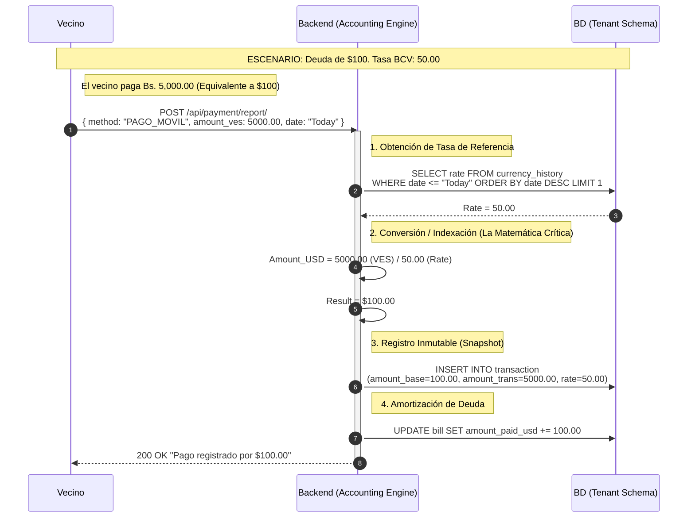
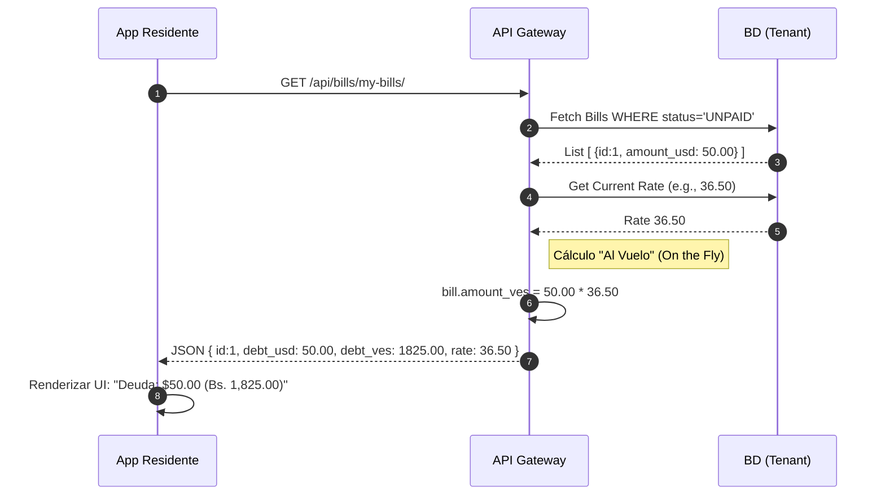
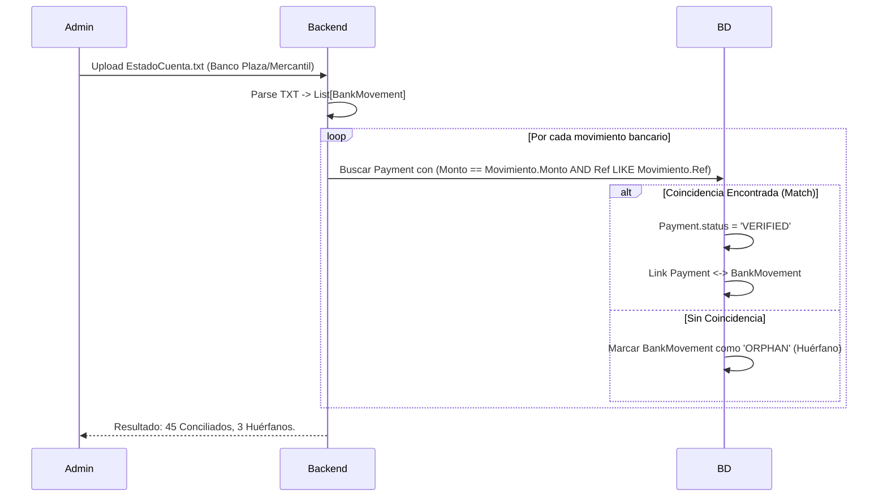
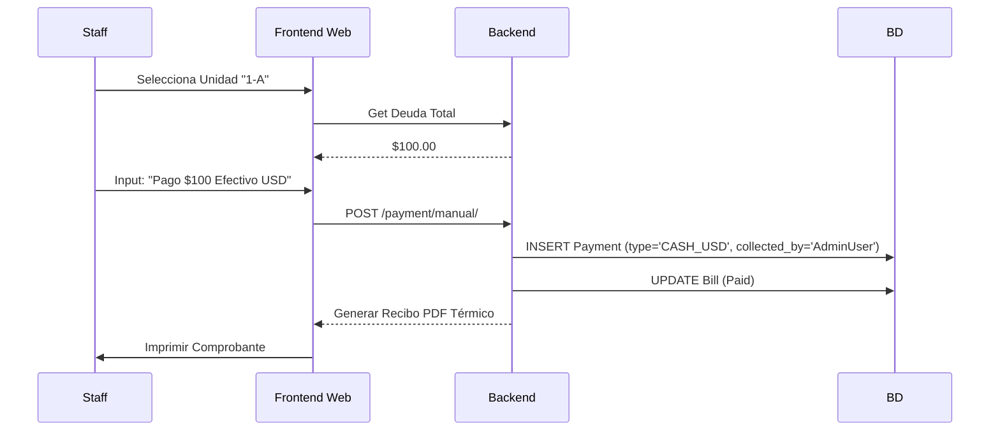
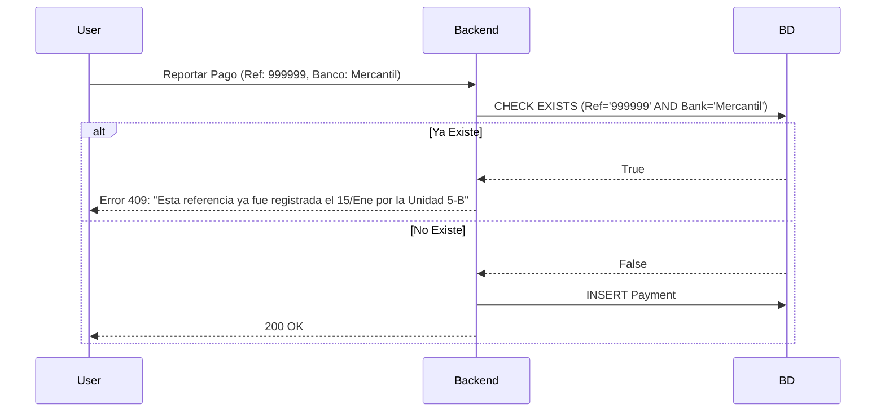

**Función #13: Economía Bimonetaria (Motor de Conversión y Persistencia)[1]**

**1. Ficha Técnica**

Contexto: Cualquier operación que involucre dinero (Generación de recibos, registro de pagos, reporte de gastos).[1]
Tecnología: Python Decimal (Cálculo de alta precisión, prohibido usar float).[1]
Ubicación en BD: Tenant Schema (Contabilidad del Condominio).
Tablas Involucradas:
tenant.CurrencyHistory: Histórico de tasas (BCV/Paralelo) con timestamp.[1]
tenant.Transaction: El libro contable.[1] Debe guardar TRES valores clave:
amount_base (Monto en USD - Moneda contable).
amount_transactional (Monto en VES - Lo que entró al banco).
exchange_rate_snapshot (La tasa usada en ese segundo exacto).
tenant.Bill: La deuda se almacena siempre en USD (amount_usd).
Disparador: Registro de Pago (Móvil) o Conciliación Bancaria.[1]
Objetivo: Permitir que la deuda se mantenga firme en Dólares ($), pero que se amortice recibiendo Bolívares (Bs), calculando la equivalencia exacta al momento de la operación.

**2. Diagrama de Secuencia Lógico**




[1]
**3. Refuerzo Lógico:** Trace de Datos (El Problema de la Fluctuación)
Este trace es vital para que el agente de IA sepa manejar la "diferencia cambiaria" y el redondeo.[1]
A. Estado de la Deuda (tenant.Bill):
Total a Pagar: $50.00.[1]
Tasa del Día: 54.50 Bs/$.[1]
B. Input del Usuario (Reporte de Pago):
El usuario hace una transferencia, pero se equivoca por centavos o la tasa cambia mientras paga.
Monto Transferido: Bs.[1] 2,700.00.[1]
C. Cálculo del Sistema (Backend):
Fórmula: "USD Credit"="Monto VES" /"Tasa"
Ejecución: 2,700.00 / 54.50 = 49.5412...[1]
Redondeo (Half Up): $49.54.[1]
D. Resultado Contable:
Se registra el pago por $49.54.[1]
Deuda Restante: $50.00 - $49.54 = $0.46.[1]
Status: La factura NO pasa a PAID. Queda en PARTIAL.
UX: El vecino ve: "Recibimos tu pago. Restan $0.46 por pagar".[1]

**Función #14: Oráculo de Tasas (Currency Exchange Rate Provider)**

**1. Ficha Técnica**
Contexto: Necesidad de mantener actualizada la tasa de cambio para calcular deudas y pagos en tiempo real.
Tecnología: Celery Beat (Cronjob) + Scrapers (BeautifulSoup/APIs).
Ubicación en BD: Tenant Schema.
Tablas Involucradas:
tenant.ExchangeRateProvider: Configuración de fuentes (BCV, Monitor, Personalizada).
tenant.CurrencyHistory: Bitácora histórica (rate, date, source).
Disparador: Automático (Cada 1 hora o 9:00 AM / 1:00 PM).
Objetivo: Evitar que el administrador tenga que cargar la tasa manual y prevenir errores de dedo.

**2. Diagrama de Secuencia Lógico**


````mermaid
sequenceDiagram
 autonumber
 participant Cron as Celery Worker
 participant External as BCV Website / API
 participant DB as BD (Tenant)
 participant Log as System Log

 Note over Cron: Ejecución programada (ej. cada hora)

 Cron->>External: GET Request (Fetch Tasa Oficial)
 activate External
 External-->>Cron: Response 200 OK <br/>{ "usd": 36.45, "date": "2024-02-20" }
 deactivate External

 Cron->>DB: SELECT rate FROM currency_history <br/>ORDER BY date DESC LIMIT 1
 DB-->>Cron: Last Rate = 36.40

 alt Tasa ha cambiado (36.45 != 36.40)
  Cron->>DB: INSERT INTO currency_history <br/>(rate=36.45, date=NOW, source='AUTO_BCV')
  Cron->>Log: Info "Tasa actualizada a 36.45"
 else Tasa igual
  Cron->>Log: Info "Sin cambios en tasa"
 end
```

**3. Refuerzo Lógico: Trace de Datos**

Input: Tasa actual BCV: 36.45.
Condición: La última tasa en DB era 36.40.
Acción: Se inserta un nuevo registro.
Impacto: A partir de ese milisegundo, cualquier vecino que consulte su deuda verá el monto en Bs recalculado a 36.45. Los pagos anteriores se quedan congelados a 36.40 (gracias al snapshot de la Función 13).

**Función #15: Indexación Dinámica de Deuda**

**1. Ficha Técnica**

Contexto: Visualización del recibo de condominio por parte del residente.
Lógica de Negocio: "La deuda vive en Dólares, se muestra en Bolívares".
Ubicación en BD: tenant.Bill.
Tablas Involucradas: tenant.Bill, tenant.CurrencyHistory.
Objetivo: Proteger el patrimonio del condominio contra la devaluación sin violar la ley (mostrando siempre la contrapartida en Bs).

**2. Diagrama de Secuencia Lógico**



**3. Refuerzo Lógico: Trace de Datos**
Escenario A (Hoy): Tasa 36.50. Deuda $50. El usuario ve "Pagar Bs. 1,825.00".
Escenario B (Mañana): Tasa sube a 40.00.
Base de Datos: Sigue diciendo $50.00. No se edita el registro.
Usuario abre la App: Cálculo en vivo 50 * 40. Ve "Pagar Bs. 2,000.00".
Conclusión: El sistema se ajusta a la inflación automáticamente sin correr procesos batch masivos nocturnos.


**Función #16: Conciliación Bancaria Híbrida**

**1. Ficha Técnica**

Contexto: El administrador valida que el dinero reportado por los vecinos realmente llegó al banco.
Tecnología: Regex Parsing (Para SMS/TXT de bancos) + Matching Algorithm.
Tablas: tenant.BankMovement (Espejo del banco), tenant.Payment.
Objetivo: Reducir el trabajo manual de puntear el estado de cuenta línea por línea.

**2. Diagrama de Secuencia Lógico**


**3. Refuerzo Lógico: Trace de Datos**
Banco (TXT): 2024-02-20 | CREDITO | 1,825.00 | REF 123456
Sistema (Payment): User: Juan | Amount: 1,825.00 | Ref: 123456
Resultado: Match Perfecto -> Pago Verificado.
Caso Huérfano: Aparece un crédito de 500 Bs en el banco sin reporte en la App. El sistema lo resalta para que el Admin investigue de quién es.

**Función #17: Taquilla de Cobro Manual**

**1. Ficha Técnica**
Contexto: Cobro presencial en la oficina de administración (Efectivo Divisas o POS Físico).
Seguridad: Requiere permisos de staff.can_collect_money.
Objetivo: Digitalizar el dinero en efectivo inmediatamente para cuadrar caja.

**2. Diagrama de Secuencia Lógico**


**3. Refuerzo Lógico: Trace de Datos**

Input: Admin recibe billete de $100.
Acción: Registra en sistema.
Auditoría: Al final del día, el reporte "Cierre de Caja" mostrará:
Bancos: 0 Bs.
Caja Chica (Efectivo): $100.
Responsable: AdminUser.

**Función #18: Validación Anti-Fraude (Referencias Duplicadas)**
**1. Ficha Técnica**
Contexto: Evitar que dos usuarios reporten la misma transferencia o que se reutilice un pago viejo.
Lógica: Unique constraint compuesta.
Tablas: tenant.Payment.

**2. Diagrama de Secuencia Lógico**



**3. Refuerzo Lógico: Trace de Datos**
Intento 1: Usuario A reporta Ref 1234. -> Éxito.
Intento 2: Usuario B (o el mismo A) intenta reportar Ref 1234 de nuevo para otra factura. -> Bloqueo.
Excepción: Si el banco recicla referencias, el sistema valida la fecha (si la referencia vieja tiene > 6 meses, permite la nueva).

**Función #19: Gestión de Fondos Virtuales**

**1. Ficha Técnica**
Contexto: Cuando entra dinero, no todo es para gastar. Parte debe ir a reservas legales.
Lógica: Ledger virtual (Libro Mayor auxiliar).
Tablas: tenant.VirtualFund, tenant.FundTransaction.

**2. Diagrama de Secuencia Lógico**

```mermaid
sequenceDiagram
 participant Trigger as Payment Verified
 participant BE as Backend
 participant DB as BD

 Note over Trigger: Entraron $100 de Condominio
 Trigger->>BE: Ejecutar Reglas de Distribución
 BE->>DB: Get Rules (e.g., Reserva=10%, Prestaciones=5%)
 BE->>DB: INSERT FundTransaction (Fund='Operativo', Amount=$85)
 BE->>DB: INSERT FundTransaction (Fund='Reserva', Amount=$10)
 BE->>DB: INSERT FundTransaction (Fund='Prestaciones', Amount=$5)
3. Refuerzo Lógico: Trace de Datos
Ingreso: $100.
Saldo Bancario Real: $100.
Saldo Disponible para Gastar (Operativo): Solo $85.
Visual: En el Dashboard, el Admin ve "Banco: $100", pero si intenta registrar un gasto de 
90
,
e
l
s
i
s
t
e
m
a
l
e
a
d
v
i
e
r
t
e
:
"
F
o
n
d
o
s
O
p
e
r
a
t
i
v
o
s
I
n
s
u
f
i
c
i
e
n
t
e
s
(
90,elsistemaleadvierte:"FondosOperativosInsuficientes(
85)".
´´´

**Función #20: Contabilidad Doble Partida**

**1. Ficha Técnica**

Contexto: Generación automática de asientos contables tras bambalinas.
Objetivo: Contabilidad formal sin contratar contador para la diaria.
Tablas: tenant.Account, tenant.JournalEntry.

**2. Diagrama de Secuencia Lógico**

```mermaid
graph TD
    A[Acción: Generar Recibo de $50] -->|Automático| B(Asiento Contable)
    B --> C{Debit: Cuentas por Cobrar $50}
    B --> D{Credit: Ingresos por Cuotas $50}

    E[Acción: Reportar Pago $50] -->|Automático| F(Asiento Contable)
    F --> G{Debit: Banco $50}
    F --> H{Credit: Cuentas por Cobrar $50}
3. Refuerzo Lógico: Trace de Datos
Saldo Inicial CxC: $0.
Generar Recibo: CxC sube a $50.
Pagar Recibo: CxC baja a $0. Banco sube a $50.
Balance: Activo (Banco) = Patrimonio (Ingresos). La ecuación contable siempre cuadra.
´´´
**Función #21: Motor Fiscal (ISLR/IVA)**

**1. Ficha Técnica**
Contexto: Pagos a proveedores en Venezuela requieren retener impuestos.
Lógica: Cálculo automático según tipo de proveedor (Jurídico/Natural) y concepto.
Tablas: tenant.Provider, tenant.TaxRetention.

**2. Diagrama de Secuencia Lógico**

```mermaid
sequenceDiagram
 participant Admin
 participant BE as Backend
 participant DB as BD

 Admin->>BE: Registrar Factura Proveedor ($1000 + IVA $160)
 BE->>DB: Check Provider "Seguridad CA" (Es Contribuyente Especial?)
 DB-->>BE: Sí. Retener 75% IVA + 2% ISLR.

 Note right of BE: Cálculos
 BE->>BE: Retención IVA = 160 * 0.75 = 120
 BE->>BE: Retención ISLR = 1000 * 0.02 = 20
 BE->>BE: A Pagar al Proveedor = 1160 - 120 - 20 = 1020

 BE->>DB: Save Expense (Total 1160)
 BE->>DB: Create Retention Voucher (PDF)
3. Refuerzo Lógico: Trace de Datos
Factura: Bs. 1,160.00.
Salida de Banco al Proveedor: Bs. 1,020.00.
Deuda al SENIAT (Pasivo): Bs. 140.00 (Se paga luego al declarar impuestos).
```

**Función #22: Generación de Estados Financieros**
**1. Ficha Técnica**
Contexto: Cierre de mes. El administrador debe enviar el reporte a los vecinos.
Tecnología: Librería PDF (WeasyPrint o ReportLab).
Input: Rango de Fechas.

**2. Diagrama de Secuencia Lógico**

```mermaid
sequenceDiagram
 participant Admin
 participant BE as Backend
 participant DB as BD

 Admin->>BE: Solicitar "Cierre Mes Febrero"
 BE->>DB: Sum(Expenses) GROUP BY Category
 BE->>DB: Get List(Morosos)
 BE->>DB: Get FundBalances
 BE->>PDF_Engine: Render HTML Template -> PDF
 PDF_Engine-->>BE: archivo_cierre.pdf
 BE-->>Admin: Download URL
3. Refuerzo Lógico: Trace de Datos
Secciones del Reporte:
Ingresos (Cobrado real).
Egresos (Pagado real + Por pagar).
Conciliación (Saldo Banco vs Saldo Libro).
Lista de Morosos (Unidad + Monto $).
Gráficos de Torta (Gastos por Categoría).
