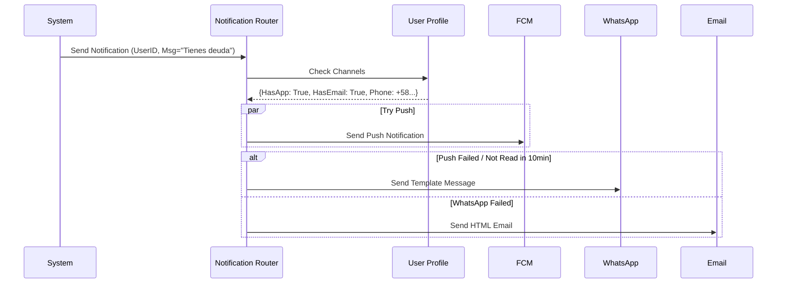
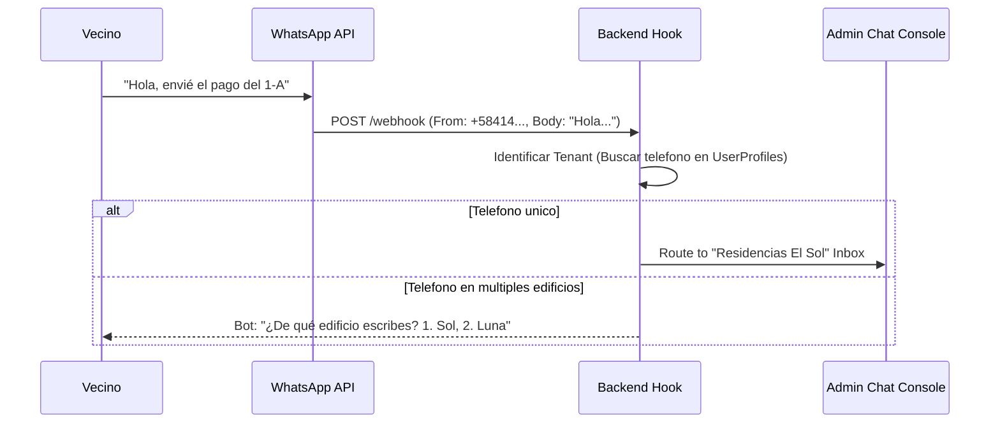
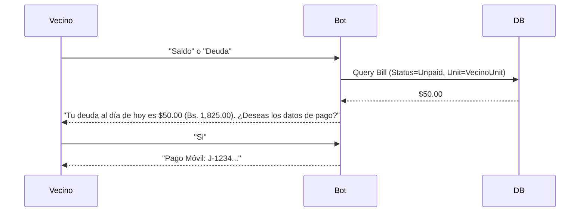
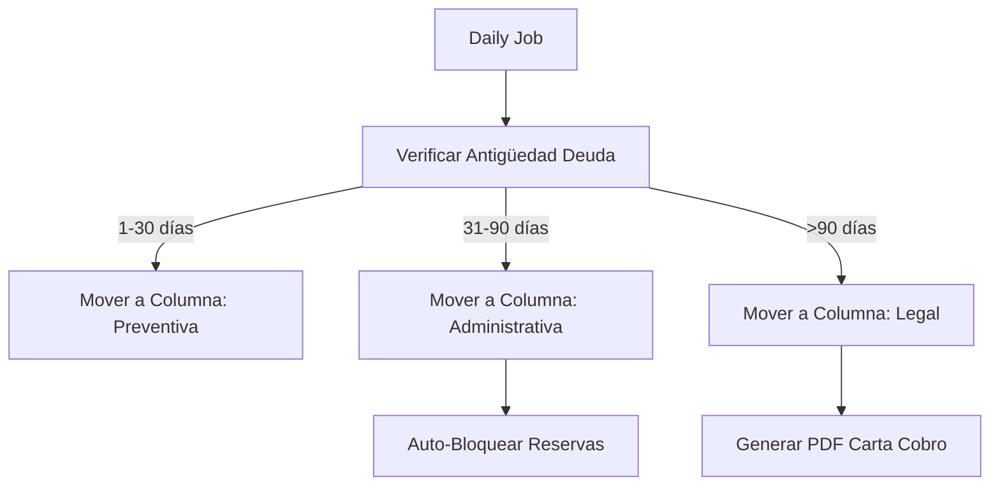
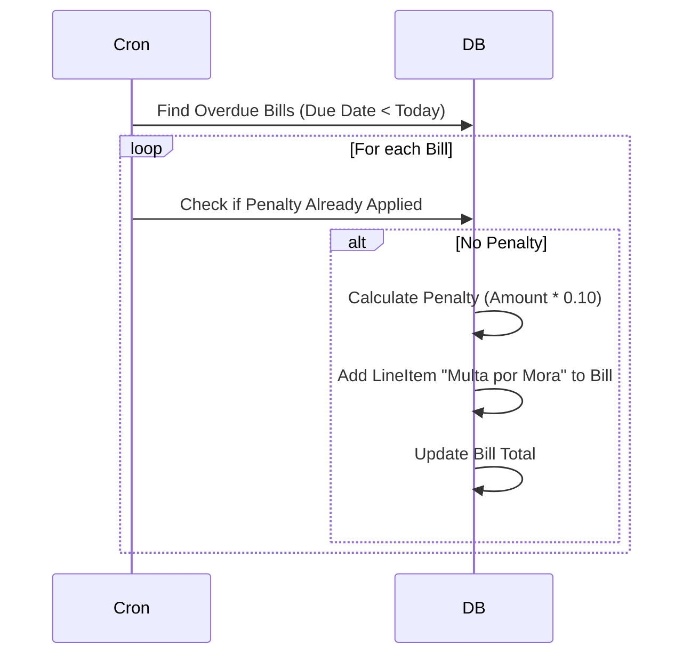
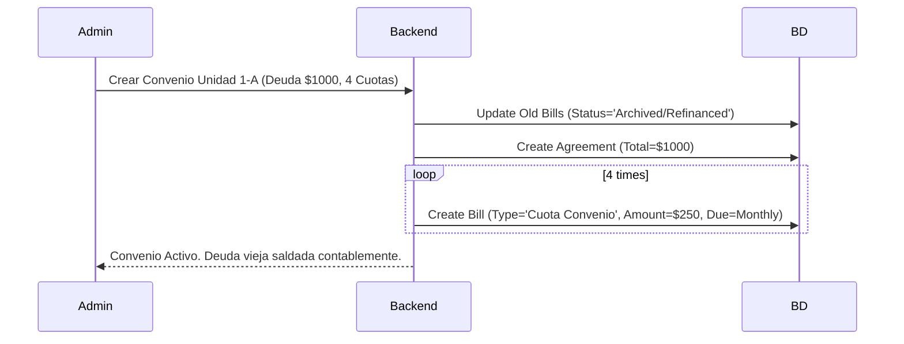
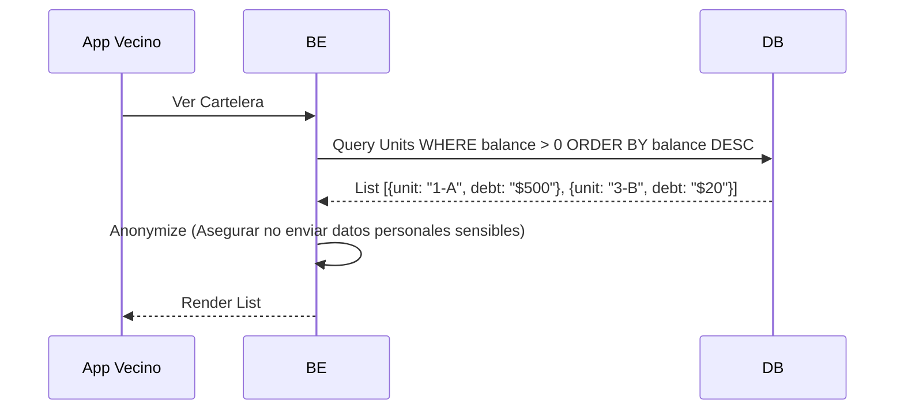
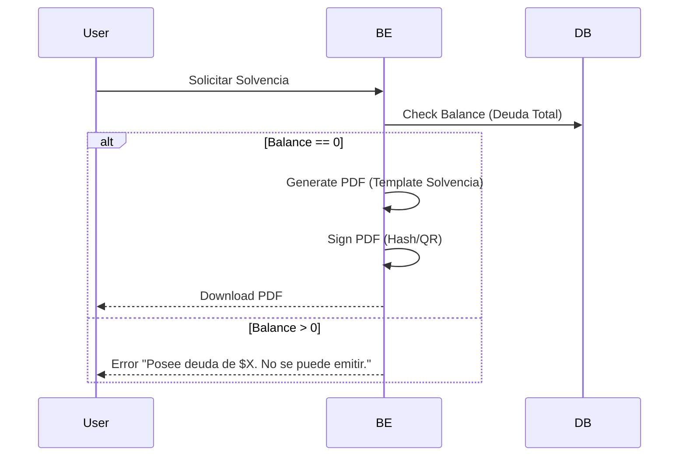
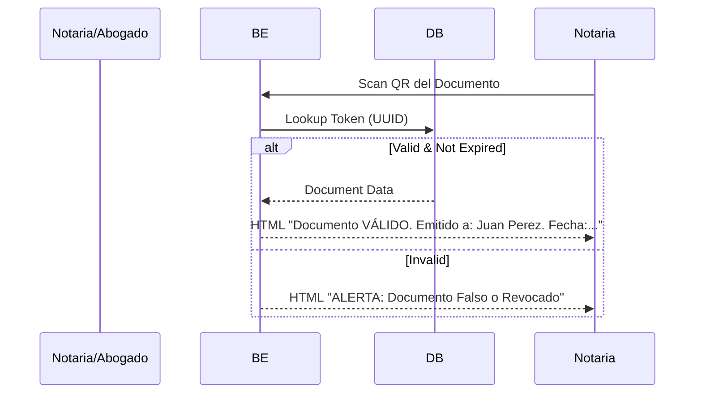

## Función #23: Gateway Omnicanal (Router de Notificaciones)

**1. Ficha Técnica**
*   **Contexto:** Enviar recibos o avisos de cobro.
*   **Problema:** No todos tienen la App instalada y el email suele ir a Spam.
*   **Lógica:** "Cascade Fallback" (Cascada de prioridad).
*   **Tecnología:** Firebase (FCM), AWS SES (Email), WhatsApp Business API.

**2. Diagrama de Secuencia Lógico**



**3. Refuerzo Lógico:** Trace de Datos
Input: Mensaje "Nuevo Recibo Generado".
Canal 1 (Push): Enviado. Estado: DELIVERED.
Timer: Espera 10 minutos. ¿Estado cambió a READ?
Condición: No leído.
Acción: Disparar WhatsApp "Hola, tienes un nuevo recibo pendiente...".

**Función #24: Microservicio WhatsApp Multi-Tenant**

**1. Ficha Técnica**
Contexto: El administrador gestiona 10 edificios. No puede tener 10 celulares.
Solución: Un solo número (o API centralizada) que enruta mensajes según el tenant_id.
Tablas: tenant.IntegrationConfig (Token de Meta/Waha).

**2. Diagrama de Secuencia Lógico**



**Función #25: Bot de Operaciones (Auto-Respuesta)**

**1. Ficha Técnica**
Contexto: 80% de las preguntas son "¿Cuánto debo?" o "¿Cuál es la cuenta?".
Lógica: NLP básico o Keyword Matching.
Objetivo: Reducir carga de soporte al conserje/admin.

**2. Diagrama de Secuencia Lógico**



**Función #26: Tablero Kanban de Cobranza**

**1. Ficha Técnica**
Contexto: Gestión visual de la morosidad.
Estados:
Preventiva: Antes del vencimiento (Recordatorios amables).
Administrativa: 1-3 meses mora (Suspensión de áreas comunes).
Extrajudicial: 3-6 meses (Abogados, Cartas).
Legal: >6 meses (Demanda).

**2. Diagrama de Secuencia Lógico**




**3. Refuerzo Lógico: Trace de Datos**
Unidad 5-C: Debe Recibo Enero (
50
)
y
F
e
b
r
e
r
o
(
50)yFebrero(
50). Fecha actual: Marzo 15.
Antigüedad: Enero tiene > 60 días.
Clasificación: El sistema mueve la tarjeta de la unidad 5-C a la columna "Cobranza Administrativa" y envía alerta al Admin.

**Función #27: Motor de Reglas de Morosidad (Intereses y Multas)**

**1. Ficha Técnica**

Contexto: Aplicar penalidades automáticamente según el Reglamento del Condominio.
Configuración: tenant.PenaltyRule (e.g., "10% si paga después del día 5").
Lógica: Se aplica sobre el monto en Divisas para no perder valor.

**2. Diagrama de Secuencia Lógico**



**3. Refuerzo Lógico: Trace de Datos**
Recibo: $100. Vence: Día 05.
Fecha: Día 06.
Regla: 10% Flat.
Acción: Se agrega ítem "Multa Mora" por $10. Nuevo total deuda: $110.
Función #28: Gestor de Convenios de Pago
1. Ficha Técnica
Contexto: Vecino debe $1,000. No puede pagar todo. Pide pagar en 4 cuotas.
Lógica: "Refinanciamiento".
Tablas: tenant.PaymentAgreement, tenant.AgreementInstallment.

**2. Diagrama de Secuencia Lógico**




**3. Refuerzo Lógico: Trace de Datos**

Estado Inicial: Deuda Vencida $1000.
Acción: Convertir en 4 facturas nuevas de $250.
Validación: Si falla una cuota, el convenio puede tener cláusula de "Aceleración" (Se vence todo de golpe).
Función #29: Cartelera Virtual de Morosos
1. Ficha Técnica
Contexto: Presión social. La ley venezolana permite publicar la lista de morosos (solo número de apartamento y monto).
Privacidad: No mostrar nombres propios en la vista pública, solo Unidad.

**2. Diagrama de Secuencia Lógico**




**Función #30: Kiosco de Autoservicio Legal (Solvencias)**

**1. Ficha Técnica**
Contexto: El propietario necesita vender o alquilar. Requiere "Carta de Solvencia".
Problema: El admin tarda 3 días en firmarla.
Solución: Generación PDF automática firmada digitalmente (QR).
2. Diagrama de Secuencia Lógico



**Función #31: Motor de Emisión y Validación QR**

**1. Ficha Técnica**
Contexto: Evitar falsificación de solvencias o cartas de residencia.
Lógica: El QR contiene una URL pública de validación.
Tablas: tenant.SignedDocument.

**2. Diagrama de Secuencia Lógico**



**3. Refuerzo Lógico: Trace de Datos**
PDF: Contiene QR apuntando a https://app.mascondominios.com/verify/abc-123.
Backend: Al recibir la visita, busca el hash abc-123.
Seguridad: Si el documento fue anulado (ej. el cheque del pago rebotó), el QR pasa a mostrar "INVALIDO" inmediatamente.

**Función #32: Bloqueo Automático de Documentos**

**1. Ficha Técnica**
Contexto: Coerción pasiva. Incentivar el pago restringiendo servicios burocráticos.
Regla: Si total_debt > 0.00, el módulo de "Autoservicio" queda deshabilitado.

**2. Diagrama de Secuencia Lógico**

```mermaid
graph LR
    User[Usuario Logueado] --> Request[Click "Descargar Solvencia"]
    Request --> Check{Check Deuda > 0}
    Check -- Si ($0.01 o más) --> Block[Return 403 Forbidden]
    Block --> Alert[Mostrar Modal: "Ponte al día para acceder"]
    Check -- No ($0.00) --> Allow[Generar Documento]
```
**3. Refuerzo Lógico: Trace de Datos**
Escenario A: Vecino debe $0.00.
Acción: Descarga Solvencia.
Escenario B: Vecino debe $0.10 (Centavos por diferencia cambiaria).
Acción: El sistema (dependiendo de la configuración de tolerance_threshold) podría bloquearlo.
Nota: Se recomienda configurar una tolerancia de $1.00 para evitar bloqueos por redondeo.

