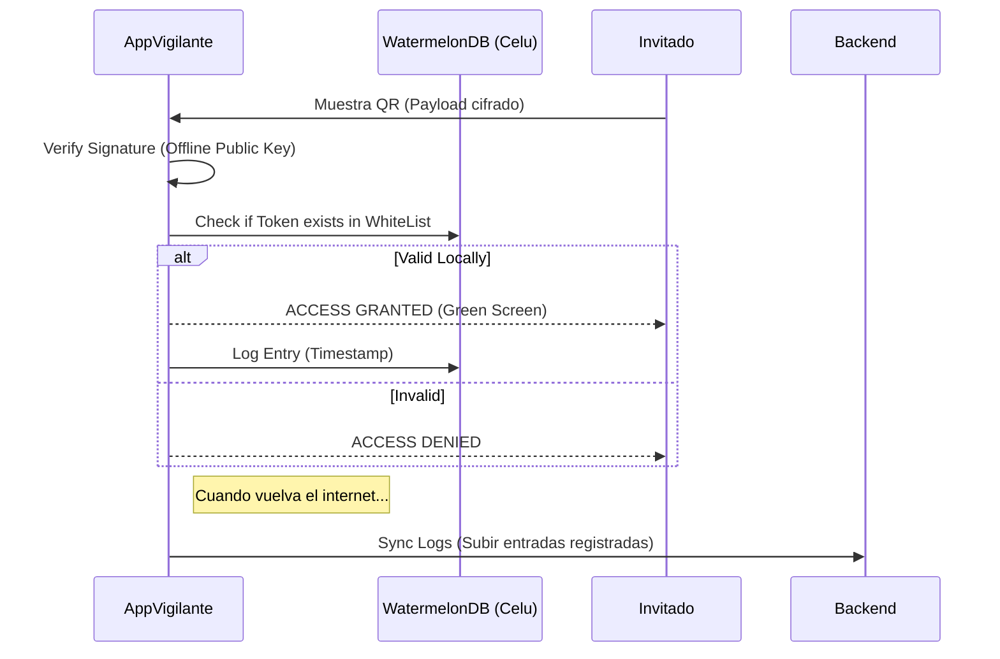
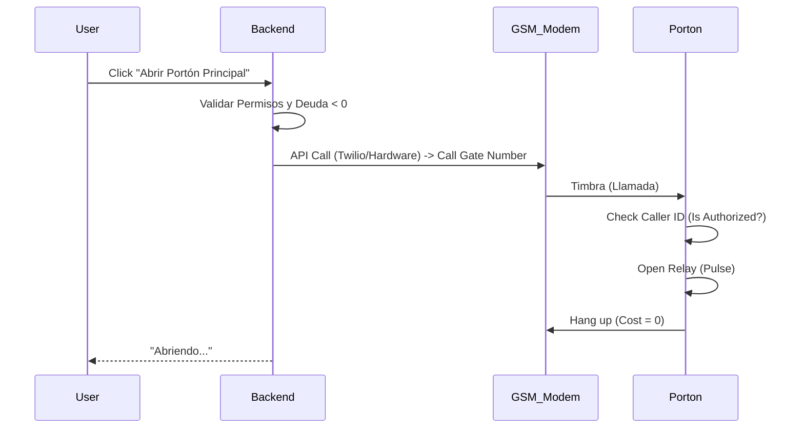
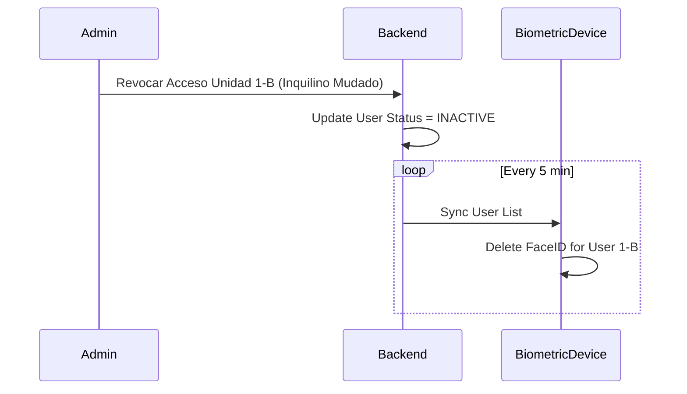
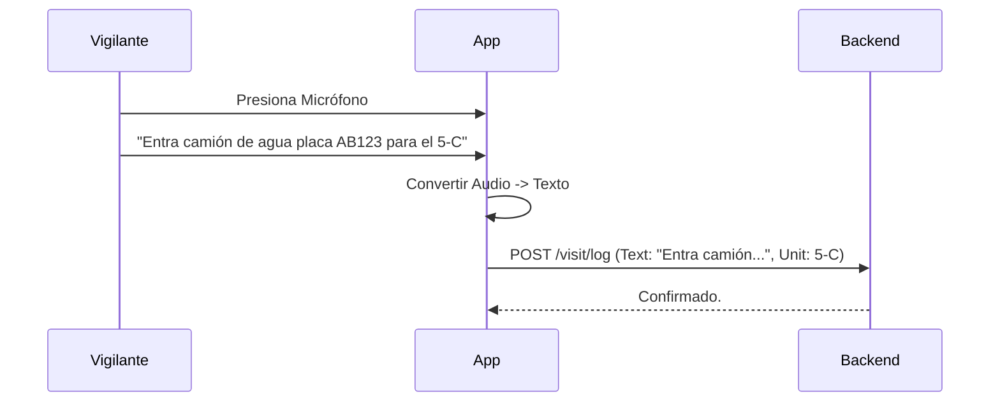
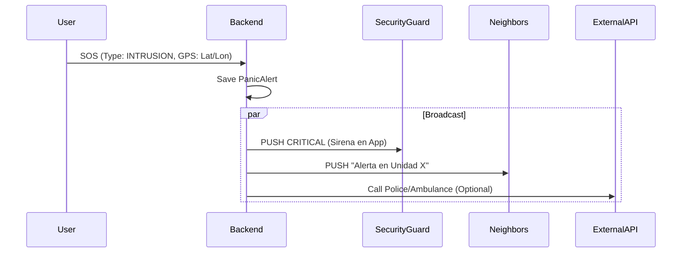
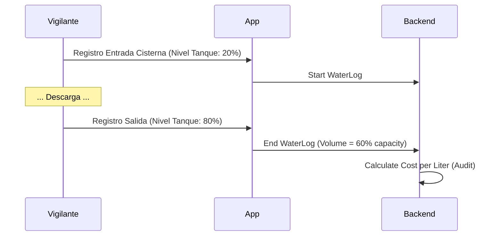
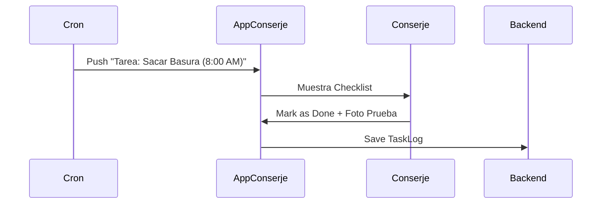
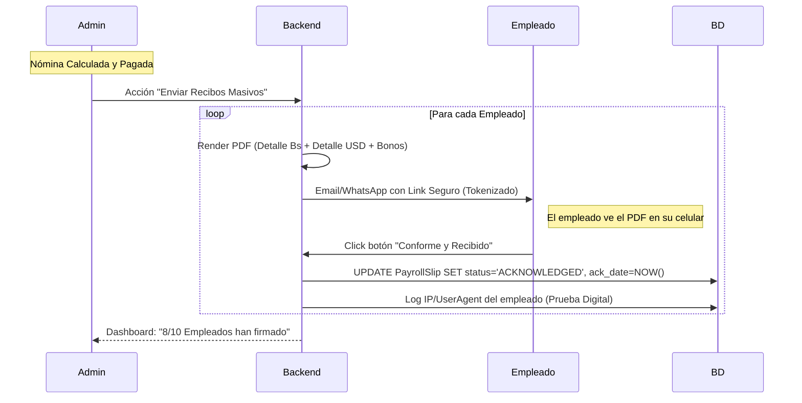

## Función #33: Validación Offline (QR Acceso)

**1. Ficha Técnica**
*   **Contexto:** El internet en la garita es lento o inexistente.
*   **Problema:** No se puede consultar al servidor si el QR de visita es válido.
*   **Tecnología:** WatermelonDB (SQLite local en el celular del vigilante) + Crypto (Ed25519).
*   **Lógica:** "Trust First, Sync Later" (Confía primero, sincroniza después).

**2. Diagrama de Secuencia Lógico**



**3. Refuerzo Lógico: Trace de Datos**
QR: Contiene json: { valid_until: 18:00, unit: 1-A, signature: xyz }.
Validación: La App verifica que now < 18:00 y que la firma coincida. No necesita consultar al servidor central en ese instante.

**Función #34: Pasarela GSM (Portones)**

1. Ficha Técnica
Contexto: Abrir el portón eléctrico desde la App.
Hardware: Módulo GSM/GPRS conectado al motor del portón.
Lógica: "Missed Call Auth" (Autenticación por llamada perdida o SMS).

**2. Diagrama de Secuencia Lógico**



**Función #35: Sincronización Biométrica**

**1. Ficha Técnica**

Contexto: Sincronizar huellas/rostros con dispositivos físicos (ZKTeco/Hikvision).
Problema: Dar de baja a un inquilino moroso o mudado automáticamente.

**2. Diagrama de Secuencia Lógico**



**Función #36: Bitácora de Visitas (Voz)**

**1. Ficha Técnica**
Contexto: Vigilantes que escriben lento o con errores ortográficos.
Solución: Dictado por voz (Speech-to-Text).
Tecnología: React Native Voice / Whisper API.
**2. Diagrama de Secuencia Lógico**




**Función #37: Botón de Pánico Enterprise**

**1. Ficha Técnica**

Contexto: Emergencia médica o seguridad (Robo en curso).
Tecnología: WebSockets (Tiempo real) + Geolocalización.
Lógica: Diferenciación de eventos (Silencioso vs Ruidoso).

**2. Diagrama de Secuencia Lógico**




**3. Refuerzo Lógico: Trace de Datos**
Evento: "Intrusión".
Acción: La App del vigilante suena al máximo volumen aunque esté en silencio. Muestra mapa con la ubicación exacta del usuario dentro del conjunto.

**Función #38: Gestión de Paquetería**

**1. Ficha Técnica**
Contexto: Recepción de delivery (Amazon/MercadoLibre) en garita.
Tecnología: OCR (Escaneo de etiquetas).

**2. Diagrama de Secuencia Lógico**


```mermaid
sequenceDiagram
 participant Courier
 participant Vigilante
 participant Backend
 participant Resident

 Courier->>Vigilante: Entrega Paquete
 Vigilante->>App: Foto a la etiqueta
 App->>Backend: OCR Process -> Extract "Unit 4-A" & "Tracking 123"
 Backend->>Resident: Push "Llegó un paquete para ti"
 Resident->>Vigilante: Recoge y firma digitalmente
 Backend->>Backend: Mark as DELIVERED

**Función #39: Semáforo de Servicios Públicos**

**1. Ficha Técnica**

Contexto: Crisis de servicios en Venezuela (¿Hay agua? ¿Llegó la luz?).
Lógica: Crowdsourcing o sensores IoT.
Visualización: Dashboard simple (Verde/Rojo).

**2. Diagrama de Secuencia Lógico**


```mermaid
graph TD
    Sensor[Sensor Nivel Tanque / Input Vigilante] --> BE[Backend]
    BE --> UpdateStatus{Update Status}
    UpdateStatus --> AppUser[App Vecino]
    AppUser --> ShowIcon[Mostrar: 💧 AGUA DE CALLE: NO]
    AppUser --> ShowIcon2[Mostrar: ⚡ PLANTA ELÉCTRICA: ON]
```

**Función #40: Bitácora de Cisternas**

**1. Ficha Técnica**
Contexto: Control del llenado del tanque subterráneo. Evitar robos de agua (camiones que descargan a medias).
Datos: Nivel Inicial, Nivel Final, Placa, Costo ($).

**2. Diagrama de Secuencia Lógico**



**3. Refuerzo Lógico: Trace de Datos**
Tanque: 100,000 Litros.
Delta: 20% -> 80% = 60% (60,000 Litros).
Factura Camión: $40.
Costo: $0.00066 por litro. Si el costo se desvía del promedio histórico, alerta de fraude.

**Función #41: Gestión de Activos Fijos**

**1. Ficha Técnica**
Contexto: Control de bombas de agua, motores de portón, plantas eléctricas.
Lógica: Mantenimiento preventivo y depreciación.
Tablas: tenant.Asset, tenant.MaintenanceLog.

**2. Diagrama de Secuencia Lógico**

```mermaid
graph LR
    Asset[Bomba Agua #1] -->|Horas Uso| Check{¿Supera 500h?}
    Check -- Si --> Alert[Generar Ticket: Cambiar Aceite]
    Check -- No --> Log[Registrar Uso]

**Función #42: Control de Inventarios (Insumos)**

**1. Ficha Técnica**

Contexto: Cloro, bolsas de basura, bombillos.
Lógica: FIFO (First-In, First-Out) para valoración de costos.

**2. Diagrama de Secuencia Lógico**

```mermaid
sequenceDiagram
 participant Staff
 participant BE
 participant DB

 Staff->>BE: Retirar 5 Bombillos
 BE->>DB: Check Stock
 DB-->>BE: Lote A ($1.00 c/u): 3 unids, Lote B ($1.20 c/u): 10 unids
 BE->>BE: Descontar 3 de Lote A + 2 de Lote B
 BE->>DB: Registrar Gasto Consumo ($3.00 + $2.40 = $5.40)
```

**3. Refuerzo Lógico: Trace de Datos**

Importante: El gasto se registra en el momento del consumo, no de la compra (dependiendo del criterio contable, pero para condominios suele ser al consumo para reflejar realidad mensual).

**Función #43: Planificador de Rutinas**

**1. Ficha Técnica**
Contexto: Tareas recurrentes del conserje (Sacar basura: Lun/Mie/Vie).
Tecnología: Cronjobs + Checklists en App Móvil.

**2. Diagrama de Secuencia Lógico**




**Función #44: Control de Asistencia (Geofencing)**

**1. Ficha Técnica**

Contexto: Evitar que el personal marque asistencia desde su casa.
Lógica: Solo permite "Check-In" si GPS está dentro de radio 50m del edificio.

**2. Diagrama de Secuencia Lógico**


```mermaid
sequenceDiagram
 participant Staff
 participant App
 participant Backend

 Staff->>App: Click "Entrada Laboral"
 App->>App: Get GPS Coords
 App->>App: Calc Distance to Building Center
 alt Distance < 50m
  App->>Backend: POST /attendance/in
  Backend-->>Staff: "Bienvenido"
 else Distance > 50m
  App-->>Staff: Error "Estás muy lejos"
 end
´´´

**Función #45: Motor de Nómina Híbrida**

**1. Ficha Técnica**
Contexto: Venezuela. Sueldo mínimo en Bs + Bono alimentación + "Bono de Guerra" en USD (Efectivo o Zelle).
Tablas: tenant.Employee, tenant.PayrollConfig.

**2. Diagrama de Secuencia Lógico**


´´´mermaid
sequenceDiagram
 participant Admin
 participant BE
 participant DB

 Admin->>BE: Generar Nómina Quincenal
 BE->>DB: Get Employees & Attendance
 loop Each Employee
  BE->>BE: Calc Base Salary (Days worked * Daily Rate Bs)
  BE->>BE: Calc Bonus USD (Fixed Amount)
  BE->>BE: Calc Deductions (SSO/LPH)
  BE->>DB: Create PayrollSlip (Monto Bs + Monto USD)
 end
 BE-->>Admin: Preview Nómina
```

**3. Refuerzo Lógico: Trace de Datos**

Empleado: Juan.
Sueldo: 130 Bs (Ley) + $100 Bono.
Recibo: Refleja ambos montos por separado para claridad legal (El bono en $ a veces no impacta prestaciones según como se configure).

**Función #46: Emisión de Recibos Digitales**

**1. Ficha Técnica**
Contexto: Entrega formal de comprobantes de pago al personal obrero/administrativo.
Problema Legal: En Venezuela, si no hay acuse de recibo firmado (o digitalmente validado), el empleado puede demandar alegando impago.
Solución: Firma digital simple (Log de aceptación) vía App o Web con traza de auditoría.
Tablas: tenant.PayrollSlip, tenant.DocumentSignature.

**2. Diagrama de Secuencia Lógico**




**3. Refuerzo Lógico: Trace de Datos**
Documento: Recibo Nómina Quincena 1 Febrero - ID #884.
Envío: 15/02/2024 09:00 AM.
Interacción: Empleado Juan Pérez abre el link.
Acción: Presiona "Aceptar" a las 09:45 AM desde IP Móvil (Digitel).
Persistencia: El sistema bloquea el PDF (lo hace inmutable) y adjunta el registro de aceptación como metadato.

