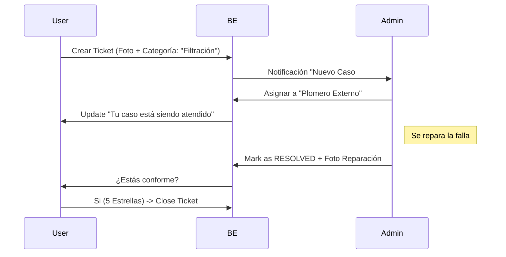
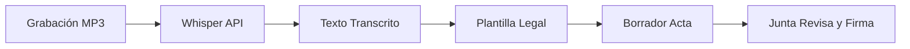
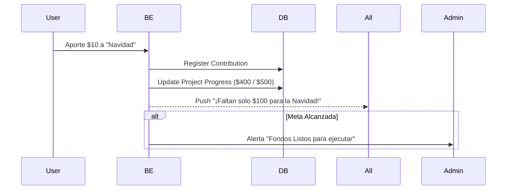
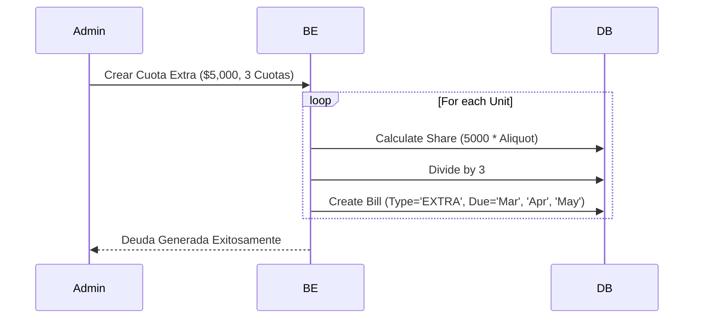
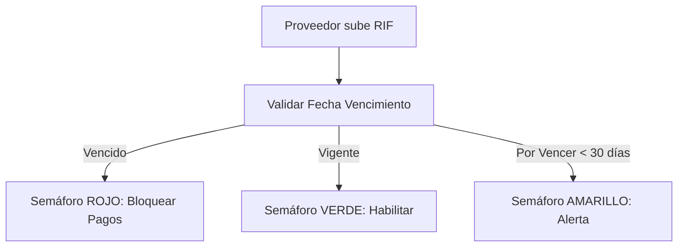
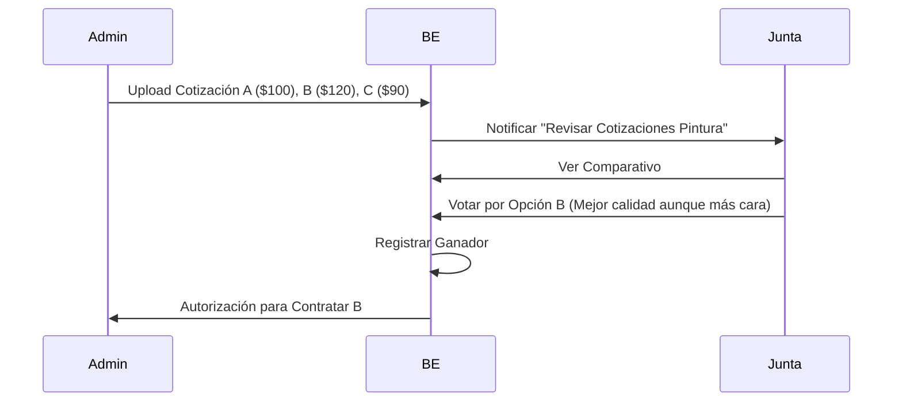
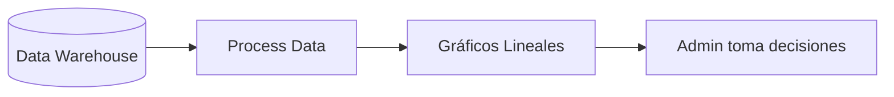

## Función #47: Sistema de Tickets PQRS

**1. Ficha Técnica**
*   **Contexto:** Peticiones, Quejas, Reclamos y Sugerencias.
*   **Problema:** El grupo de WhatsApp es un caos. Se pierden los reportes importantes.
*   **Flujo:** `OPEN` -> `IN_PROGRESS` -> `RESOLVED` -> `CLOSED`.
*   **SLA:** Alerta si un ticket crítico (ej. "Fuga de Gas") lleva > 2 horas abierto.

**2. Diagrama de Secuencia Lógico**



**Función #48: Asignación Externa (WhatsApp Work Order)**

**1. Ficha Técnica**

Contexto: El plomero/electricista no tiene la App instalada.
Solución: Enviar la orden de trabajo vía WhatsApp con un "Magic Link" para que suba la foto de la reparación sin loguearse.

**2. Diagrama de Secuencia Lógico**


```mermaid
sequenceDiagram
 participant System
 participant WhatsApp
 participant Proveedor

 System->>WhatsApp: Send Template "Nueva Orden #404. Dirección: Apto 3-B. Falla: Filtración."
 WhatsApp->>Proveedor: Mensaje con Link "Subir Evidencia"
 Proveedor->>System: (Vía Web Móvil) Upload Foto
 System->>System: Attach photo to Ticket #404
 System->>System: Change status to 'REVIEW_PENDING'


**Función #49: Votaciones y Encuestas (No Vinculantes)**

**1. Ficha Técnica**

Contexto: Decisiones sencillas (Color de pintura, fecha de la fiesta).
Lógica: 1 Voto por Unidad (o por Usuario, configurable).

**2. Diagrama de Secuencia Lógico**


```mermaid
graph TD
    Admin[Admin Crea Encuesta] --> Push[Push a Vecinos]
    Push --> Vote[Vecino Vota]
    Vote --> RealTime[Actualizar Gráfica Barras]
    RealTime --> Result[Resultado Final]

**Función #50: Asambleas Híbridas (Legal LPH)**

**1. Ficha Técnica**

Contexto: Asambleas formales donde se decide presupuesto.
Reto Venezuela: Muchos propietarios están fuera del país (Diáspora).
Lógica Crítica: El peso del voto no es "1 persona = 1 voto". Es Porcentaje de Alícuota.
Penthouse (1.5% alícuota) vale más que Estudio (0.5%).
Tablas: tenant.Vote, tenant.Assembly.

**2. Diagrama de Secuencia Lógico**


```mermaid
sequenceDiagram
 participant Owner
 participant BE
 participant DB

 Owner->>BE: Emitir Voto (Opción A: Aprobar Presupuesto)
 BE->>DB: Get Property Aliquot (e.g., 0.0150)
 BE->>DB: Insert Vote (Option='A', Weight=0.0150)
 BE->>BE: Recalculate Totals
 Note right of BE: Suma de Alícuotas
 BE-->>All: Update "Quorum Actual: 65.50%"
 alt Quorum > 75%
  BE->>BE: Validar Decisión como Vinculante
 else Quorum < 75%
  BE->>BE: Marcar como "Segunda Convocatoria necesaria"
 end
```

**3. Refuerzo Lógico: Trace de Datos**

Total Alícuotas: 100.0000%.
Voto PH (Dueño en España): 1.5000%.
Voto Apto 1A (Dueño presente): 0.8000%.
Resultado: Gana la opción que sume más porcentaje de propiedad, no más manos alzadas.

**Función #51: Libro de Actas con Dictado**

**1. Ficha Técnica**
Contexto: Al terminar la asamblea, hay que redactar el Acta legal.
Tecnología: Speech-to-Text para transcribir la grabación de la reunión (Zoom/Meet).
Salida: Borrador de Acta en PDF.

**2. Diagrama de Secuencia Lógico**




**Función #52: Crowdfunding Interno ("La Vaca")**

**1. Ficha Técnica**

Contexto: Recaudación voluntaria para mejoras no presupuestadas (ej. Decoración Navidad).
Lógica: Meta financiera. Barras de progreso.
Diferencia: No genera deuda ni morosidad. Es opcional.
2. Diagrama de Secuencia Lógico



**Función #53: Cuotas Extraordinarias**

**1. Ficha Técnica**
Contexto: Gasto mayor urgente (Reparación Ascensor: $5,000).
Lógica: Se divide según alícuota y se generan recibos separados del condominio ordinario.
Plazos: Puede dividirse en N cuotas mensuales.

**2. Diagrama de Secuencia Lógico**



**Función #54: Directorio con Semáforo Fiscal**

**1. Ficha Técnica**

Contexto: Contratar proveedores.
Riesgo: Contratar empresas con RIF vencido o fantasmas.
Lógica: Validación contra portal del SENIAT (si hay API disponible) o verificación de formato y fecha de vencimiento cargada.

**2. Diagrama de Secuencia Lógico**



**Función #55: Comparador de Presupuestos**

**1. Ficha Técnica**

Contexto: Transparencia en compras.
Regla: Para gastos > $X, se exigen 3 cotizaciones.
Visualización: Tabla comparativa lado a lado.

**2. Diagrama de Secuencia Lógico**




**Función #56: Adjudicación Democrática**

**1. Ficha Técnica**

Contexto: Dejar que la comunidad elija el proveedor (para obras estéticas).
Flujo: Combina "Comparador" con "Votaciones".

**Función #57: Dashboard Analítico (BI)**

**1. Ficha Técnica**

Contexto: Inteligencia de Negocios.
Métricas Clave:
% Morosidad Histórica.
Gasto Real vs Presupuesto.
Tendencia de Inflación interna (Cuánto sube el condominio en $ al año).

**2. Diagrama de Secuencia Lógico**




**Función #58: Normalización Financiera**

**1. Ficha Técnica**

Contexto: Comparar peras con manzanas.
Problema: Un gasto de 100 Bs en Enero no es igual a 100 Bs en Diciembre.
Solución: Todos los gráficos históricos se renderizan convirtiendo los montos a la tasa del día del gasto a una moneda dura (USD/EUR) para que la curva sea real.
2. Trace de Datos
Gasto Enero: 500 Bs (Tasa 10) = $50.
Gasto Junio: 2000 Bs (Tasa 40) = $50.
Gráfico en Bs: Muestra una subida exponencial (parece que gastamos más).
Gráfico Normalizado ($): Muestra una línea plana (gastamos lo mismo). Esta es la vista que importa

**Función #59: Health Score del Edificio**

**1. Ficha Técnica**
Contexto: Un "Score de Crédito" pero para la gestión del condominio. Permite a la Junta de Condominio saber si el Administrador está haciendo un buen trabajo con un solo número.
Algoritmo: Promedio Ponderado de 4 pilares clave.
Visualización: Velocímetro (Gauge Chart) en el Dashboard Principal.
Escala: 0-100 (0-40 Crítico, 41-70 Estable, 71-100 Saludable).

**2. Diagrama de Lógica de Cálculo**


```mermaid
graph TD
    Fin[Financiero: % Recaudación] -->|Peso 40%| Calc((Algoritmo Ponderado))
    Ops[Operativo: % Tickets Cerrados] -->|Peso 30%| Calc
    Legal[Legal: % Actas Firmadas] -->|Peso 20%| Calc
    Soc[Social: Promedio Encuestas] -->|Peso 10%| Calc

    Calc --> Score{Puntaje Final}
    Score -->|0-40| Red[Estado: CRÍTICO 🔴]
    Score -->|41-70| Yellow[Estado: ESTABLE 🟡]
    Score -->|71-100| Green[Estado: SALUDABLE 🟢]

**3. Refuerzo Lógico: Trace de Datos**

Inputs:
Financiero: Se cobró el 90% de lo facturado este mes. (Puntaje 90 * 0.40 = 36 pts).
Operativo: Se dañó el ascensor y lleva 15 días parado. Tickets resueltos bajo. (Puntaje 50 * 0.30 = 15 pts).
Legal: Libros al día. (Puntaje 100 * 0.20 = 20 pts).
Social: Encuesta satisfacción 4/5 estrellas. (Puntaje 80 * 0.10 = 8 pts).
Cálculo: 36 + 15 + 20 + 8 = 79.
Resultado: 79/100 (Saludable).
Acción: El sistema muestra una insignia de "Edificio Certificado" en el perfil público (útil para valorizar las propiedades).

